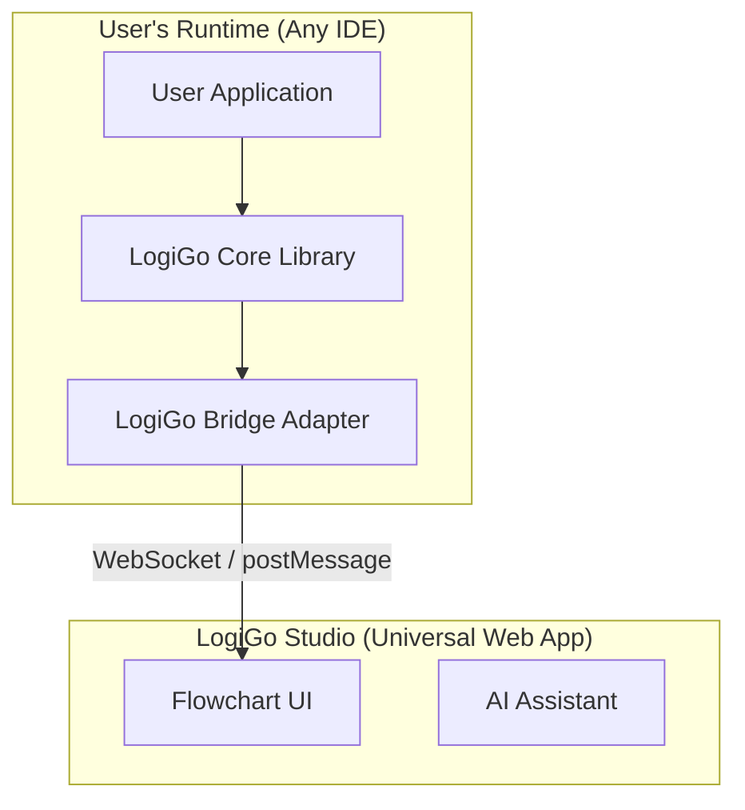

# LogiGo Architecture Proposal: The "Universal Sidecar" Strategy

## Executive Summary
To ensure feature parity and maintainability across **Replit**, **VS Code**, and **Antigravity**, we propose a unified **"Universal Sidecar" architecture**. This approach decouples the LogiGo Studio UI from the specific IDE, allowing it to run as a standalone web app (or "Sidecar") that connects to the user's runtime environment.

**Recommendation:** Antigravity should develop the `@logigo/bridge` core library immediately, as we have already successfully scaffolded the VS Code implementation. This code can then be dropped into the Replit project.

---

## 1. The Architecture

## 2. What is `@logigo/bridge`?
This is a standalone TypeScript package that provides:

1.  **Unified Parsing Logic:**
    *   Uses `acorn` to parse JavaScript/TypeScript into the Flowchart JSON format expected by LogiGo Studio.
    *   *Benefit:* Fix a parsing bug once, and it's fixed for both Replit and VS Code.

2.  **Standardized Message Protocol:**
    *   Type definitions for `LOGIGO_CHECKPOINT`, `LOGIGO_JUMP_TO_LINE`, etc.
    *   *Benefit:* Ensures the Studio UI works identically regardless of which IDE it's running in.

3.  **Checkpoint Injection Utility:**
    *   A function `injectCheckpoints(code: string): string` that safely inserts `LogiGo.checkpoint()` calls into the AST.
    *   *Benefit:* Complex logic (handling loops, async functions) is centralized and tested.

## 3. Implementation Options for Replit
Since the formal Replit Extension Marketplace is not available, we propose two robust alternatives:

### Option A: The "Webview Server" (Recommended)
*   **Concept:** Run LogiGo Studio as a standard Express/Vite app *inside* the user's Repl.
*   **Mechanism:**
    1.  User installs `logigo-studio` as a dev dependency.
    2.  User runs `npx logigo start`.
    3.  Replit opens the Studio in a "Webview" pane (just like opening a preview of their app).
*   **Pros:**
    *   Zero friction setup (standard npm package).
    *   Full access to the file system (it's running locally in the Repl).
    *   Works immediately without waiting for platform approval.

### Option B: The "Standalone Sidecar"
*   **Concept:** Host LogiGo Studio at `studio.logigo.dev`.
*   **Mechanism:**
    1.  User installs `logigo-core` in their Repl.
    2.  User opens `studio.logigo.dev` in a separate tab.
    3.  The two connect via a secure handshake (or manual copy-paste for MVP).
*   **Pros:**
    *   One URL for everyone.
*   **Cons:**
    *   Harder to access the user's file system for editing code.

## 4. Proposed Next Steps
1.  **Antigravity** extracts the logic from the VS Code prototype into `@logigo/bridge`.
2.  **Antigravity** provides the `bridge` source code (or npm package) to the Replit team.
3.  **Replit Team** implements **Option A (Webview Server)**:
    *   Create a simple CLI wrapper that serves the Studio static files.
    *   Use the `bridge` to handle file parsing and communication.

---
*Generated by Antigravity for the LogiGo Team*
