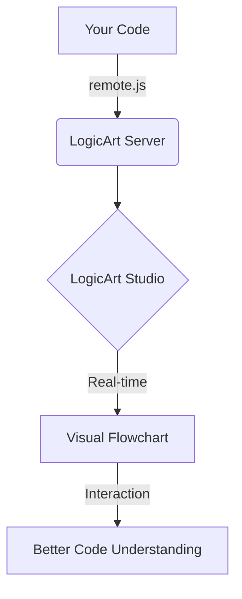

# LOGICART DOCS AUDIT


## 1. HELP DIALOG (Layout & Filters)
import React, { useState, useEffect } from 'react';
import {
  Dialog,
  DialogContent,
  DialogDescription,
  DialogHeader,
  DialogTitle,
} from '@/components/ui/dialog';
import { ScrollArea } from '@/components/ui/scroll-area';
import {
  Zap,
  Code2,
  Keyboard,
  Info,
  Lightbulb,
  Sparkles,
  ChevronRight,
  BookOpen,
  Github,
  Layers,
  Workflow,
  Layout,
  ExternalLink,
  Wand2,
  Image as ImageIcon
} from 'lucide-react';
import { useTutorial } from '@/contexts/TutorialContext';
import { Button } from '@/components/ui/button';
import ReactMarkdown from 'react-markdown';
import remarkGfm from 'remark-gfm';
import Mermaid from '@/components/ui/Mermaid';
import { ConnectWizard } from './ConnectWizard';
import { cn } from '@/lib/utils';

interface HelpDialogProps {
  open: boolean;
  onOpenChange: (open: boolean) => void;
  initialSection?: string;
}

const VISIBLE_DOCS = [
  { id: 'getting-started', title: 'Getting Started', emoji: '🚀', slug: 'getting-started' },
  { id: 'vibe-coder-guide', title: 'Vibe Coder Guide', emoji: '✨', slug: 'vibe-coder-guide' },
  { id: 'agent-api', title: 'Agent API', emoji: '🤖', slug: 'agent-api' },
  { id: 'integration-wizard', title: 'Integration Wizard', emoji: '🪄', component: true },
  { id: 'common-pitfalls', title: 'Common Pitfalls', emoji: '⚠️', slug: 'common-pitfalls' },
  { id: 'api-reference', title: 'API Reference', emoji: '🔧', slug: 'api-reference' },
  { id: 'arena-masterclass', title: 'Arena Masterclass', emoji: '🏛', slug: 'arena-masterclass' },
  { id: 'remote-sync', title: 'Remote Sync Guide', emoji: '🛰', slug: 'remote-sync' },
  { id: 'file-sync', title: 'File Sync Guide', emoji: '🔄', slug: 'file-sync' },
];

const GALLERY_ITEMS = [
  {
    title: 'Sorting Algorithms',
    url: '/demo/library/sorting.html',
    icon: <Workflow className="w-4 h-4 text-blue-400" />,
    description: 'Visualization of Bubble, Quick, and Merge sort.'
  },
  {
    title: 'Ghost Diff Demo',
    url: '/demo/ghost_diff.html',
    icon: <Layers className="w-4 h-4 text-purple-400" />,
    description: 'See execution diffs in real-time.'
  },
  {
    title: 'Visual Handshake',
    url: '/demo/visual_handshake.html',
    icon: <Sparkles className="w-4 h-4 text-amber-400" />,
    description: 'Connecting code to DOM elements.'
  }
];

const InfoBox = ({ children }: { children: React.ReactNode }) => (
  <div className="bg-blue-500/10 border border-blue-500/20 rounded-xl p-4 my-6 flex gap-3 text-sm text-blue-100/80 leading-relaxed shadow-sm animate-in fade-in duration-500">
    <div className="text-xl">💡</div>
    <div className="flex-1 prose-invert prose-sm">
      {children}
    </div>
  </div>
);

export function HelpDialog({ open, onOpenChange, initialSection }: HelpDialogProps) {
  const { startTutorial } = useTutorial();
  const [activeSection, setActiveSection] = useState<string>(initialSection || 'getting-started');
  const [docContent, setDocContent] = useState<string | null>(null);
  const [isLoading, setIsLoading] = useState(false);

  useEffect(() => {
    if (initialSection) {
      setActiveSection(initialSection);
    }
  }, [initialSection]);

  useEffect(() => {
    const doc = VISIBLE_DOCS.find(d => d.id === activeSection);
    if (doc && doc.slug) {
      fetchDoc(doc.slug);
    } else {
      setDocContent(null);
    }
  }, [activeSection]);

  const fetchDoc = async (slug: string) => {
    setIsLoading(true);
    try {
      const response = await fetch(`/api/docs/${slug}`);
      if (response.ok) {
        const data = await response.json();
        setDocContent(data.content);
      } else {
        setDocContent('Failed to load documentation.');
      }
    } catch (error) {
      setDocContent('Error loading documentation.');
    } finally {
      setIsLoading(false);
    }
  };

  const renderContent = () => {
    if (activeSection === 'integration-wizard') {
      return <ConnectWizard />;
    }

    if (activeSection === 'shortcuts') {
      return (
        <div className="space-y-6 pr-4">
          <section>
            <h3 className="text-lg font-semibold mb-3">Execution Control</h3>
            <div className="space-y-2">
              <ShortcutRow shortcut="Space or K" description="Play / Pause execution" />
              <ShortcutRow shortcut="S or →" description="Step forward (next step)" />
              <ShortcutRow shortcut="B or ←" description="Step backward (Time Travel)" />
              <ShortcutRow shortcut="R" description="Reset execution" />
              <ShortcutRow shortcut="L" description="Toggle loop mode" />
            </div>
          </section>
          <section>
            <h3 className="text-lg font-semibold mb-3">Speed Control</h3>
            <div className="space-y-2">
              <ShortcutRow shortcut="[" description="Decrease speed" />
              <ShortcutRow shortcut="]" description="Increase speed" />
              <ShortcutRow shortcut="1-5" description="Set speed preset (1=0.5x, 2=1x, 3=2x, 4=5x, 5=10x)" />
            </div>
          </section>
          <section>
            <h3 className="text-lg font-semibold mb-3">View & Navigation</h3>
            <div className="space-y-2">
              <ShortcutRow shortcut="F" description="Toggle fullscreen (Workspace mode)" />
              <ShortcutRow shortcut="Escape" description="Exit fullscreen" />
              <ShortcutRow shortcut="V" description="Toggle variables panel" />
              <ShortcutRow shortcut="D" description="Toggle Ghost Diff overlay" />
              <ShortcutRow shortcut="Cmd/Ctrl + K" description="Focus Natural Language Search" />
            </div>
          </section>
        </div>
      );
    }

    if (activeSection === 'about') {
      return (
        <div className="space-y-6 pr-4 text-sm text-muted-foreground">
          <section>
            <h3 className="text-lg font-semibold text-foreground mb-2">LogicArt Studio</h3>
            <p>
              A bidirectional code-to-flowchart visualization tool designed for "Vibe Coders" who benefit from visual learning and debugging.
            </p>
          </section>
          <section>
            <h3 className="text-lg font-semibold text-foreground mb-2">Version</h3>
            <p><strong>LogicArt Studio:</strong> v1.2.0-stable</p>
          </section>
          <section>
            <h3 className="text-lg font-semibold text-foreground mb-2">Key Features</h3>
            <ul className="grid grid-cols-2 gap-x-4 gap-y-1">
              <li>✓ Static code analysis</li>
              <li>✓ Live Mode debugging</li>
              <li>✓ Time Travel execution</li>
              <li>✓ View Levels (1000ft, etc)</li>
              <li>✓ Ghost Diff overlays</li>
              <li>✓ Multi-AI Model Arena</li>
              <li>✓ MCP Integration</li>
              <li>✓ VS Code Extension</li>
            </ul>
          </section>
        </div>
      );
    }

    if (activeSection === 'gallery') {
      return (
        <div className="space-y-8 pr-4 animate-in fade-in slide-in-from-bottom-4 duration-500">
          <div className="grid grid-cols-1 md:grid-cols-2 gap-4">
            {GALLERY_ITEMS.map((item, idx) => (
              <a
                key={idx}
                href={item.url}
                target="_blank"
                rel="noopener noreferrer"
                className="group p-5 bg-muted/30 rounded-2xl border border-white/5 hover:border-primary/40 hover:bg-muted/50 transition-all shadow-sm"
              >
                <div className="flex items-start gap-4">
                  <div className="p-3 bg-background rounded-xl border border-white/5 group-hover:scale-110 transition-transform">
                    {item.icon}
                  </div>
                  <div className="flex-1">
                    <h4 className="font-bold text-foreground group-hover:text-primary transition-colors">{item.title}</h4>
                    <p className="text-xs text-muted-foreground mt-1 leading-relaxed">{item.description}</p>
                  </div>
                  <ExternalLink className="w-3.5 h-3.5 text-muted-foreground group-hover:text-primary opacity-0 group-hover:opacity-100 transition-all" />
                </div>
              </a>
            ))}
          </div>
        </div>
      );
    }

    if (isLoading) {
      return (
        <div className="flex items-center justify-center h-64">
          <div className="animate-spin rounded-full h-8 w-8 border-b-2 border-primary"></div>
        </div>
      );
    }

    if (docContent) {
      return (
        <div className="markdown-content pb-8">
          <ReactMarkdown
            remarkPlugins={[remarkGfm]}
            components={{
              code({ node, inline, className, children, ...props }: any) {
                const match = /language-(\w+)/.exec(className || '');
                const language = match ? match[1] : '';

                if (!inline && language === 'mermaid') {
                  return <Mermaid chart={String(children).replace(/\n$/, '')} />;
                }

                if (!inline && language === 'callout') {
                  return <InfoBox>{children}</InfoBox>;
                }

                return !inline ? (
                  <div className="relative group my-4">
                    <pre className="p-3 bg-muted/80 rounded-lg overflow-x-auto border border-white/5 font-mono text-[13px] shadow-inner">
                      <code className={className} {...props}>
                        {children}
                      </code>
                    </pre>
                  </div>
                ) : (
                  <code className="bg-muted px-1.5 py-0.5 rounded text-[13px] text-primary" {...props}>
                    {children}
                  </code>
                );
              },
              h1: ({ children }) => <h1 className="text-2xl font-bold mb-4 text-white tracking-tight">{children}</h1>,
              h2: ({ children }) => <h2 className="text-xl font-semibold mt-8 mb-3 border-b border-white/5 pb-2 text-slate-100 tracking-tight">{children}</h2>,
              h3: ({ children }) => <h3 className="text-lg font-semibold mt-6 mb-2 text-slate-200">{children}</h3>,
              p: ({ children }) => <p className="text-slate-400 leading-relaxed mb-4 text-sm">{children}</p>,
              ul: ({ children }) => <ul className="list-disc pl-5 mb-4 space-y-1 text-slate-400 text-sm">{children}</ul>,
              ol: ({ children }) => <ol className="list-decimal pl-5 mb-4 space-y-1 text-slate-400 text-sm">{children}</ol>,
              li: ({ children }) => <li className="pl-1">{children}</li>,
              strong: ({ children }) => <strong className="text-slate-200 font-semibold">{children}</strong>,
              hr: () => <hr className="my-6 border-white/5" />,
              table: ({ children }) => <table className="w-full my-4 text-sm border-collapse">{children}</table>,
              th: ({ children }) => <th className="text-left p-2 border-b border-white/10 text-slate-300 font-semibold">{children}</th>,
              td: ({ children }) => <td className="p-2 border-b border-white/5 text-slate-400">{children}</td>
            }}
          >
            {docContent}
          </ReactMarkdown>
        </div>
      );
    }

    return null;
  };

  return (
    <Dialog open={open} onOpenChange={onOpenChange}>
      <DialogContent className="max-w-[1100px] h-[90vh] p-0 overflow-hidden border-white/10 shadow-2xl bg-[#09090b]">
        <div className="flex h-full w-full overflow-hidden">
          {/* Sidebar */}
          <div className="w-[260px] flex flex-col border-r border-white/5 bg-[#0e0e11]">
            <div className="p-6 border-b border-white/5">
              <div className="flex items-center gap-2.5 mb-1.5">
                <div className="w-8 h-8 bg-blue-600 rounded-lg flex items-center justify-center font-bold text-white shadow-[0_0_15px_rgba(37,99,235,0.4)]">
                  L
                </div>
                <h2 className="font-bold text-lg tracking-tight">LogicArt Doc</h2>
              </div>
              <p className="text-[10px] text-muted-foreground font-medium uppercase tracking-[0.1em] opacity-60">Documentation Center v1.3</p>
            </div>

            <ScrollArea className="flex-1 px-3 py-4">
              <div className="space-y-6">
                <div>
                  <div className="px-3 mb-2 text-[10px] font-bold text-muted-foreground/50 uppercase tracking-widest">General</div>
                  <div className="space-y-1">
                    {VISIBLE_DOCS.map((doc) => (
                      <button
                        key={doc.id}
                        onClick={() => setActiveSection(doc.id)}
                        className={cn(
                          "w-full flex items-center gap-3 px-3 py-2 rounded-xl text-sm transition-all group",
                          activeSection === doc.id
                            ? "bg-primary/20 text-primary border border-primary/20 shadow-[0_0_10px_rgba(37,99,235,0.1)]"
                            : "text-muted-foreground hover:text-white hover:bg-white/5"
                        )}
                      >
                        <span className="text-base grayscale group-hover:grayscale-0 transition-all">{doc.emoji}</span>
                        <span className="font-medium">{doc.title}</span>
                      </button>
                    ))}
                  </div>
                </div>

                <div>
                  <div className="px-3 mb-2 text-[10px] font-bold text-muted-foreground/50 uppercase tracking-widest">Resources</div>
                  <div className="space-y-1">
                    <button
                      onClick={() => setActiveSection('shortcuts')}
                      className={cn(
                        "w-full flex items-center gap-3 px-3 py-2 rounded-xl text-sm transition-all group",
                        activeSection === 'shortcuts' ? "bg-primary/20 text-primary border border-primary/20" : "text-muted-foreground hover:text-white"
                      )}
                    >
                      <Keyboard className="w-4 h-4" />
                      <span className="font-medium">Shortcuts</span>
                    </button>
                    <button
                      onClick={() => setActiveSection('gallery')}
                      className={cn(
                        "w-full flex items-center gap-3 px-3 py-2 rounded-xl text-sm transition-all group",
                        activeSection === 'gallery' ? "bg-primary/20 text-primary border border-primary/20" : "text-muted-foreground hover:text-white"
                      )}
                    >
                      <ImageIcon className="w-4 h-4" />
                      <span className="font-medium">Showcase Gallery</span>
                    </button>
                    <button
                      onClick={() => setActiveSection('about')}
                      className={cn(
                        "w-full flex items-center gap-3 px-3 py-2 rounded-xl text-sm transition-all group",
                        activeSection === 'about' ? "bg-primary/20 text-primary border border-primary/20" : "text-muted-foreground hover:text-white"
                      )}
                    >
                      <Info className="w-4 h-4" />
                      <span className="font-medium">About LogicArt</span>
                    </button>
                  </div>
                </div>

                <div className="pt-4 mt-4 border-t border-white/5">
                  <div className="px-3 mb-2 text-[10px] font-bold text-muted-foreground/50 uppercase tracking-widest">Interactive Tours</div>
                  <div className="space-y-1">
                    <button
                      onClick={() => { onOpenChange(false); startTutorial('agent-nudge'); }}
                      className="w-full flex items-center justify-between px-3 py-2 rounded-xl text-xs text-blue-400 hover:bg-blue-400/10 transition-colors"
                    >
                      <span>The Agent Bridge</span>
                      <ChevronRight className="w-3 h-3" />
                    </button>
                    <button
                      onClick={() => { onOpenChange(false); startTutorial('vibe-master'); }}
                      className="w-full flex items-center justify-between px-3 py-2 rounded-xl text-xs text-purple-400 hover:bg-purple-400/10 transition-colors"
                    >
                      <span>The Vibe Master</span>
                      <ChevronRight className="w-3 h-3" />
                    </button>
                  </div>
                </div>
              </div>
            </ScrollArea>

            <div className="p-4 bg-muted/20 border-t border-white/5">
              <a
                href="https://github.com/JPaulGrayson/LogicArt"
                target="_blank"
                rel="noopener"
                className="flex items-center gap-2 text-[10px] text-muted-foreground hover:text-white transition-colors"
              >
                <Github className="w-3 h-3" />
                View Source on GitHub
              </a>
            </div>
          </div>

          {/* Main Content Area */}
          <div className="flex-1 flex flex-col min-w-0 overflow-hidden bg-[#09090b]">
            <header className="px-6 py-4 border-b border-white/5 flex items-center justify-between bg-[#0e0e11]/50 backdrop-blur-md flex-shrink-0">
              <div>
                <h2 className="text-lg font-bold tracking-tight capitalize">
                  {VISIBLE_DOCS.find(d => d.id === activeSection)?.title ||
                    (activeSection === 'shortcuts' ? 'Shortcuts' :
                      activeSection === 'about' ? 'About LogicArt' :
                        activeSection === 'gallery' ? 'Showcase Gallery' : '')}
                </h2>
              </div>
              <Button variant="ghost" size="sm" onClick={() => onOpenChange(false)} className="text-muted-foreground hover:text-white">
                Close
              </Button>
            </header>

            <div className="flex-1 overflow-auto">
              <div key={activeSection} className="px-6 py-6">
                {renderContent()}
              </div>
            </div>
          </div>
        </div>
      </DialogContent>
    </Dialog>
  );
}

function ShortcutRow({ shortcut, description }: { shortcut: string; description: string }) {
  return (
    <div className="flex items-center justify-between py-2 px-4 rounded-xl bg-white/5 border border-white/5 hover:bg-white/10 transition-all">
      <span className="text-sm text-slate-300">{description}</span>
      <kbd className="px-2 py-1 text-[10px] font-bold text-primary bg-primary/10 border border-primary/20 rounded shadow-sm font-mono">
        {shortcut}
      </kbd>
    </div>
  );
}


## 2. MERMAID COMPONENT (Visuals)
import React, { useEffect, useRef } from 'react';
import mermaid from 'mermaid';

interface MermaidProps {
    chart: string;
}

// Initialize mermaid
mermaid.initialize({
    startOnLoad: true,
    theme: 'dark',
    securityLevel: 'loose',
    fontFamily: 'Outfit, sans-serif',
});

const Mermaid: React.FC<MermaidProps> = ({ chart }) => {
    const ref = useRef<HTMLDivElement>(null);

    useEffect(() => {
        if (ref.current && chart) {
            ref.current.removeAttribute('data-processed');
            mermaid.contentLoaded();
        }
    }, [chart]);

    return (
        <div className="mermaid flex justify-center py-8 bg-muted/20 rounded-xl my-6 overflow-hidden" ref={ref}>
            {chart}
        </div>
    );
};

export default Mermaid;


## 3. CONNECT WIZARD (Integration)
import React, { useState } from 'react';
import { Button } from '@/components/ui/button';
import { Card, CardContent, CardDescription, CardHeader, CardTitle } from '@/components/ui/card';
import { Copy, Terminal, Wand2, Check, ExternalLink, Sparkles, Code2 } from 'lucide-react';
import { toast } from 'sonner';

const SCRIPT_TAG = `<script src="https://logicart-studio-jpaulgrayson.replit.app/remote.js?mode=push&hideBadge=true"></script>`;

const AGENT_PROMPT = `Add LogicArt code visualization to this project.

1. Add this script tag to the HTML <head>:
<script src="https://logicart-studio-jpaulgrayson.replit.app/remote.js?mode=push&hideBadge=true"></script>

2. Create a visualization handler:
const handleVisualize = (code, name) => {
  if (window.LogicArt?.visualize) {
    window.LogicArt.visualize(code, name);
  }
};

3. Call handleVisualize with CLEAN algorithm code (not framework code):
handleVisualize(algorithms[selectedAlgorithm], selectedAlgorithm);

4. Connect the handler to a "View Flowchart" button.

5. TEST: Click the button - LogicArt should open with a clean flowchart.

Available LogicArt methods:
- visualize(code, name) - One-shot: registers code and opens LogicArt (recommended)
- registerCode(code, name) - Just registers code without opening
- openStudio() - Opens LogicArt in a new tab

The project name is auto-detected from your app's hostname.`;

export function ConnectWizard() {
    const [copiedScript, setCopiedScript] = useState(false);
    const [copiedPrompt, setCopiedPrompt] = useState(false);

    const copyScript = () => {
        navigator.clipboard.writeText(SCRIPT_TAG);
        setCopiedScript(true);
        toast.success('Script tag copied to clipboard!');
        setTimeout(() => setCopiedScript(false), 2000);
    };

    const copyPrompt = () => {
        navigator.clipboard.writeText(AGENT_PROMPT);
        setCopiedPrompt(true);
        toast.success('Agent prompt copied!');
        setTimeout(() => setCopiedPrompt(false), 2000);
    };

    return (
        <div className="space-y-8 animate-in fade-in slide-in-from-bottom-4 duration-500">
            <div className="flex items-center gap-3 mb-2">
                <div className="p-2.5 bg-primary/10 rounded-xl border border-primary/20 shadow-sm">
                    <Wand2 className="w-5 h-5 text-primary" />
                </div>
                <div>
                    <h2 className="text-2xl font-bold tracking-tight">Integration Wizard</h2>
                    <p className="text-muted-foreground text-sm">Connect your external app to LogicArt in seconds.</p>
                </div>
            </div>

            <div className="grid gap-6">
                {/* Step 1 */}
                <Card className="border-primary/20 bg-primary/5 hover:bg-primary/10 transition-colors shadow-none">
                    <CardHeader className="pb-3">
                        <CardTitle className="text-base flex items-center gap-2">
                            <span className="flex items-center justify-center w-6 h-6 rounded-full bg-primary text-primary-foreground text-xs font-bold">1</span>
                            The Bridge Script
                        </CardTitle>
                        <CardDescription className="text-xs">
                            Add this single line to your app's HTML <code className="bg-primary/10 px-1 rounded">&lt;head&gt;</code> tag.
                        </CardDescription>
                    </CardHeader>
                    <CardContent className="space-y-4">
                        <div className="relative group">
                            <pre className="p-4 bg-muted/80 rounded-xl overflow-x-auto text-[13px] font-mono border border-white/5 shadow-inner">
                                <code className="text-primary">{SCRIPT_TAG}</code>
                            </pre>
                            <Button
                                size="sm"
                                variant="secondary"
                                className="absolute top-2 right-2 opacity-0 group-hover:opacity-100 transition-all shadow-lg"
                                onClick={copyScript}
                            >
                                {copiedScript ? <Check className="w-3.5 h-3.5 mr-1" /> : <Copy className="w-3.5 h-3.5 mr-1" />}
                                {copiedScript ? 'Copied' : 'Copy'}
                            </Button>
                        </div>
                        <div className="flex items-center gap-2 text-[11px] text-muted-foreground bg-white/5 p-2 rounded-lg">
                            <Sparkles className="w-3 h-3 text-amber-400" />
                            <span>Automatically sets up execution mirroring and AI grounding protocols.</span>
                        </div>
                    </CardContent>
                </Card>

                {/* Step 2 */}
                <Card className="border-blue-500/20 bg-blue-500/5 hover:bg-blue-500/10 transition-colors shadow-none">
                    <CardHeader className="pb-3">
                        <CardTitle className="text-base flex items-center gap-2">
                            <span className="flex items-center justify-center w-6 h-6 rounded-full bg-blue-500 text-white text-xs font-bold">2</span>
                            Ask AI Agent to Integrate
                        </CardTitle>
                        <CardDescription className="text-xs">
                            Copy this prompt and paste it into your AI agent (Replit Agent, Cursor, or GPT-4o).
                        </CardDescription>
                    </CardHeader>
                    <CardContent className="space-y-4">
                        <div className="relative group">
                            <div className="p-4 bg-muted/80 rounded-xl text-[13px] leading-relaxed border border-white/5 italic text-muted-foreground shadow-inner whitespace-pre-wrap">
                                "{AGENT_PROMPT}"
                            </div>
                            <Button
                                className="w-full mt-4 bg-blue-600 hover:bg-blue-500 text-white shadow-[0_10px_20px_rgba(37,99,235,0.2)]"
                                onClick={copyPrompt}
                            >
                                {copiedPrompt ? <Check className="w-4 h-4 mr-2" /> : <Sparkles className="w-4 h-4 mr-2" />}
                                {copiedPrompt ? 'Prompt Copied!' : 'Copy Prompt for Replit Agent'}
                            </Button>
                        </div>
                    </CardContent>
                </Card>
            </div>

            <div className="flex items-center justify-between p-4 bg-muted/30 rounded-xl border border-white/5 opacity-80">
                <div className="flex items-center gap-2 text-xs">
                    <Terminal className="w-4 h-4" />
                    <span>Manual setup? View the complete <a href="/docs/remote-sync" className="text-primary hover:underline font-medium">Remote Sync Guide</a></span>
                </div>
                <ExternalLink className="w-3.5 h-3.5" />
            </div>
        </div>
    );
}


## 4. GETTING STARTED (Content)
# LogicArt Getting Started Guide

**Learn to visualize and debug JavaScript code in 5 minutes**



---

```callout
LogicArt is designed for "Vibe Coders" who want to lead the Agent through structural intent rather than just typing lines of code.
```

---

## 🎯 What You'll Learn

By the end of this guide, you'll know how to:
- ✅ Visualize any JavaScript function as a flowchart
- ✅ Step through code execution line by line
- ✅ Track variable values in real-time
- ✅ Set breakpoints for debugging
- ✅ Share flowcharts with your team

---

## 🚀 Quick Start (2 Minutes)

### Step 1: Open LogicArt Studio

Navigate to [LogicArt Studio](https://logicart.studio) *(or your deployed URL)*

### Step 2: Paste Code

Copy this example and paste it into the code editor:

```javascript
function findMax(numbers) {
  let max = numbers[0];
  
  for (let i = 1; i < numbers.length; i++) {
    if (numbers[i] > max) {
      max = numbers[i];
    }
  }
  
  return max;
}
```

### Step 3: See the Flowchart

The flowchart appears automatically in the right panel.

**✅ Expected Result:**
- Nodes for each statement (initialization, loop, comparison, return)
- Edges showing control flow
- Container nodes for the loop structure

### Step 4: Step Through Execution

Use keyboard shortcuts to control execution:

| Key | Action | What Happens |
|-----|--------|--------------|
| `Space` or `K` | Play/Pause | Auto-steps through code |
| `S` | Step Forward | Advances one node |
| `B` | Step Backward | Goes back one node |
| `R` | Reset | Returns to start |

**Try it:** Press `Space` to watch the flowchart highlight each step!

---

## 🎨 Adding Human-Readable Labels

Make your flowcharts easier to understand with custom labels.

### Without Labels (Default)

```javascript
let total = 0;
if (items.length === 0) {
  return 0;
}
```

**Flowchart shows:** `let total = 0;`, `if (items.length === 0)`, `return 0;`

### With Labels (Better!)

```javascript
// @logicart: Initialize running total
let total = 0;

// @logicart: Check if array is empty
if (items.length === 0) {
  // @logicart: Return zero for empty array
  return 0;
}

// @logicart: Calculate sum of all items
for (let i = 0; i < items.length; i++) {
  // @logicart: Add current item to total
  total += items[i];
}

// @logicart: Return final sum
return total;
```

**Flowchart shows:** "Initialize running total", "Check if array is empty", etc.

**Visual Indicator:** Labeled nodes have a **blue dot** in the corner. Hover to see original code.

---

## 🔍 Understanding the Interface

### Main Components

```
┌─────────────────────────────────────────────────────────┐
│  LogicArt Studio                                          │
├──────────────────┬──────────────────────────────────────┤
│                  │                                      │
│  Code Editor     │  Flowchart Visualization            │
│                  │                                      │
│  - Monaco Editor │  - Interactive nodes                │
│  - Syntax        │  - Step highlighting                │
│    highlighting  │  - Zoom/pan controls                │
│  - Line numbers  │                                      │
│                  │                                      │
├──────────────────┴──────────────────────────────────────┤
│  Debug Panel (Floating)                                 │
│  - Current step indicator                               │
│  - Variable values                                      │
│  - Call stack                                           │
└─────────────────────────────────────────────────────────┘
```

### Debug Panel Features

The floating Debug Panel shows real-time execution state:

**Current Step Tab:**
- Step number (e.g., "Step 5/12")
- Active node label
- Current function name

**Variables Tab:**
- All tracked variables
- Current values
- Type information

**Call Stack Tab:**
- Function call hierarchy
- Current execution context

**History Tab:**
- Variable changes over time
- Timeline of execution

---

## ⌨️ Keyboard Shortcuts (Learn These!)

### Essential Shortcuts

| Key | Action | When to Use |
|-----|--------|-------------|
| `Space` or `K` | Play/Pause | Auto-step through code |
| `S` | Step Forward | Advance one node manually |
| `B` | Step Backward | Review previous steps |
| `R` | Reset | Start from beginning |

### Advanced Shortcuts

| Key | Action | When to Use |
|-----|--------|-------------|
| `F` | Fullscreen | Focus on flowchart |
| `Escape` | Exit Fullscreen | Return to normal view |
| `Ctrl/Cmd + Z` | Undo | Revert code changes |
| `Ctrl/Cmd + Y` | Redo | Reapply code changes |
| `Ctrl/Cmd + O` | Import File | Load code from file |
| `Ctrl/Cmd + S` | Export File | Save code to file |

**💡 Pro Tip:** Press `?` in LogicArt Studio to see the full shortcut reference.

---

## 🐛 Debugging with Breakpoints

### Setting Breakpoints

**Method 1: Right-click a node**
1. Right-click any flowchart node
2. Select "Set Breakpoint"
3. Node border turns red

**Method 2: Click the node border**
1. Click the left edge of a node
2. Red indicator appears

### Using Breakpoints

1. Set breakpoints on critical nodes (e.g., before a complex calculation)
2. Press `Space` to start execution
3. Execution **pauses automatically** when reaching a breakpoint
4. Inspect variables in the Debug Panel
5. Press `Space` again to continue

**Use Case Example:**
```javascript
function processOrder(order) {
  // Set breakpoint here to inspect order data
  const total = calculateTotal(order.items);
  
  // Set breakpoint here to verify total before payment
  const payment = processPayment(total);
  
  return payment;
}
```

---

## 📊 Variable Tracking

### Automatic Tracking (Static Mode)

LogicArt automatically tracks variables in your code:

```javascript
function fibonacci(n) {
  let a = 0;  // Tracked
  let b = 1;  // Tracked
  
  for (let i = 2; i <= n; i++) {  // i is tracked
    let temp = a + b;  // temp is tracked
    a = b;
    b = temp;
  }
  
  return b;
}
```

**Debug Panel shows:**
```
Variables:
  n: 5
  a: 3
  b: 5
  i: 5
  temp: 5
```

### Manual Tracking (Live Mode)

For advanced tracking with `logicart-core`:

```javascript
import { checkpoint } from 'logicart-core';

function processData(data) {
  checkpoint('process:start', { data });
  
  const result = transform(data);
  
  checkpoint('process:complete', { result });
  return result;
}
```

---

## 🎓 Try These Examples

LogicArt Studio includes built-in examples. Click the **EXAMPLES** dropdown to try:

### 1. Bubble Sort
**What it teaches:** Nested loops, array manipulation, swapping

```javascript
function bubbleSort(arr) {
  for (let i = 0; i < arr.length; i++) {
    for (let j = 0; j < arr.length - i - 1; j++) {
      if (arr[j] > arr[j + 1]) {
        [arr[j], arr[j + 1]] = [arr[j + 1], arr[j]];
      }
    }
  }
  return arr;
}
```

**Try:** Watch how the inner loop shrinks each iteration

### 2. Fibonacci (Recursive)
**What it teaches:** Recursion, base cases, call stack

```javascript
function fibonacci(n) {
  if (n <= 1) return n;
  return fibonacci(n - 1) + fibonacci(n - 2);
}
```

**Try:** Set a breakpoint on the recursive call and watch the call stack

### 3. Tic-Tac-Toe Winner Check
**What it teaches:** Complex conditionals, game logic

```javascript
function checkWinner(board) {
  // Check rows
  for (let i = 0; i < 3; i++) {
    if (board[i][0] === board[i][1] && 
        board[i][1] === board[i][2] && 
        board[i][0] !== null) {
      return board[i][0];
    }
  }
  // ... more checks
}
```

**Try:** Step through to understand the win condition logic

---

## 🔗 Sharing Flowcharts

### Create a Shareable Link

1. Click the **Share** button (top-right)
2. Add optional title: "Bubble Sort Algorithm"
3. Add optional description: "Demonstrates nested loop optimization"
4. Click **Generate Link**
5. Copy the URL

### What Recipients See

When someone opens your shared link, they get:
- ✅ Complete source code (read-only)
- ✅ Interactive flowchart
- ✅ Step-through controls
- ✅ Variable tracking
- ✅ Your title and description

**Use Cases:**
- Code reviews
- Teaching algorithms
- Documentation
- Bug reports

---

## 🤖 AI Model Arena

Get code generation help from 4 AI models simultaneously.

### How to Use

1. Click **Model Arena** in the navigation
2. Enter a prompt: *"Generate a binary search algorithm with edge case handling"*
3. Click **Submit**
4. See responses from:
   - **GPT-4o** (OpenAI)
   - **Gemini** (Google)
   - **Claude** (Anthropic)
   - **Grok** (xAI)
5. Read the **Chairman Verdict** for a synthesized recommendation

### Example Prompts

**Algorithm Generation:**
```
Generate a merge sort algorithm with detailed comments
```

**Debugging Help:**
```
Why does this function return undefined for empty arrays?
[paste your code]
```

**Optimization:**
```
How can I optimize this nested loop for better performance?
[paste your code]
```

**Code Explanation:**
```
Explain this recursive function step by step
[paste your code]
```

---

## 📱 Layout Presets

Customize your workspace with layout presets.

### Available Presets

| Preset | Layout | Best For |
|--------|--------|----------|
| **Default** | 50/50 split | Balanced view |
| **Code Focus** | 70% code, 30% flowchart | Writing code |
| **Flowchart Focus** | 30% code, 70% flowchart | Debugging |
| **Presentation** | Fullscreen flowchart | Demos, teaching |

**Access:** Click the layout icon (top-right) and select a preset

---

## 🎯 Common Workflows

### Workflow 1: Understanding New Code

1. Paste code into LogicArt Studio
2. Add `// @logicart:` labels for clarity
3. Press `Space` to auto-step through
4. Watch variable values in Debug Panel
5. Set breakpoints on confusing sections
6. Step through manually to understand

### Workflow 2: Debugging a Bug

1. Paste buggy code into LogicArt Studio
2. Set breakpoints before the suspected bug
3. Press `Space` to run to breakpoint
4. Inspect variable values
5. Step forward with `S` to find where values go wrong
6. Fix code and re-test

### Workflow 3: Teaching an Algorithm

1. Write algorithm with clear `// @logicart:` labels
2. Click **Share** to generate link
3. Send link to students
4. Students can step through at their own pace
5. They see variable changes in real-time

### Workflow 4: Code Review

1. Paste code to review
2. Add `// @logicart:` labels explaining intent
3. Step through to verify logic
4. Share link with team for discussion
5. Use Debug Panel to verify edge cases

---

## 🚀 Next Steps

### For Beginners
- ✅ Try all built-in examples
- ✅ Practice adding `// @logicart:` labels
- ✅ Learn keyboard shortcuts
- ✅ Share a flowchart with a friend

### For Developers
- ✅ Read the [Installation Guide](INSTALLATION_GUIDE.md) to add LogicArt to your projects
- ✅ Try the `logicart-embed` React component
- ✅ Explore the [API Reference](API_REFERENCE.md)

### For Teams
- ✅ Use shared flowcharts for code reviews
- ✅ Create a library of algorithm visualizations
- ✅ Use Model Arena for collaborative problem-solving

---

## 🐛 Troubleshooting

### Flowchart shows "Syntax Error"

**Cause:** Your code has a JavaScript syntax error

**Fix:**
1. Check the code editor for red underlines
2. Ensure all brackets/parentheses are balanced
3. Remove TypeScript-specific syntax (e.g., type annotations)

### Variables not showing in Debug Panel

**Cause:** Variables might be out of scope or not yet initialized

**Fix:**
1. Step forward to where variables are declared
2. Check that you're viewing the correct execution step
3. Ensure the variable is in the current function scope

### Flowchart nodes are too small

**Fix:**
1. Use the zoom controls (bottom-right of flowchart)
2. Click the "Fit View" button to auto-zoom
3. Try the "Flowchart Focus" layout preset

### Can't find a keyboard shortcut

**Fix:**
- Press `?` in LogicArt Studio to see all shortcuts
- Check the Help dialog (click `?` icon in top-right)

---

## 💡 Pro Tips

### Tip 1: Use Descriptive Checkpoint IDs
```javascript
// ❌ Bad
checkpoint('cp1', { data });
checkpoint('cp2', { result });

// ✅ Good
checkpoint('validation:start', { data });
checkpoint('validation:complete', { result });
```

### Tip 2: Snapshot Arrays
```javascript
// ❌ Bad (reference, not snapshot)
checkpoint('sort:step', { arr });

// ✅ Good (snapshot with spread)
checkpoint('sort:step', { arr: [...arr] });
```

### Tip 3: Use Breakpoints Strategically
Set breakpoints:
- Before complex calculations
- At loop boundaries
- Before/after API calls
- At error handling points

### Tip 4: Combine Labels and Checkpoints
```javascript
// @logicart: Validate user input
if (!isValid(input)) {
  checkpoint('validation:failed', { input, errors });
  return null;
}
```

---

## 📚 Additional Resources

- **[Installation Guide](INSTALLATION_GUIDE.md)** - Add LogicArt to your projects
- **[API Reference](API_REFERENCE.md)** - Complete API documentation
- **[GitHub Repository](https://github.com/JPaulGrayson/LogicArt)** - Source code and issues
- **Help Dialog** - Press `?` in LogicArt Studio

---

## 🎓 Learning Path

### Week 1: Basics
- [ ] Complete this Getting Started guide
- [ ] Try all built-in examples
- [ ] Master keyboard shortcuts
- [ ] Share your first flowchart

### Week 2: Integration
- [ ] Read the Installation Guide
- [ ] Add LogicArt to a personal project
- [ ] Create custom checkpoints
- [ ] Use breakpoints for debugging

### Week 3: Advanced
- [ ] Read the API Reference
- [ ] Try the Vite plugin
- [ ] Use Model Arena for code generation
- [ ] Create a library of reusable visualizations

---

**Made with ❤️ for Vibe Coders who learn by seeing**

**Questions?** Check the [Installation Guide](INSTALLATION_GUIDE.md) or [open an issue](https://github.com/JPaulGrayson/LogicArt/issues).
