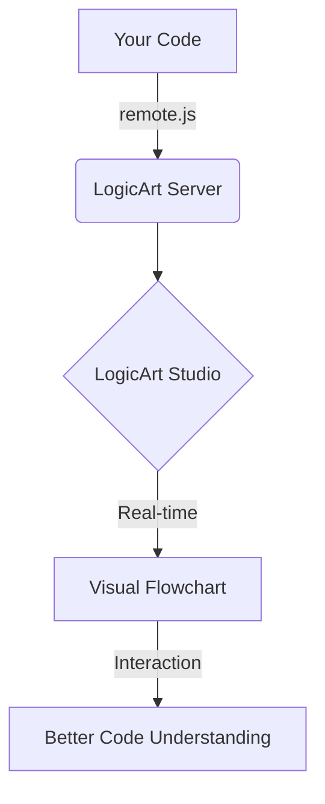
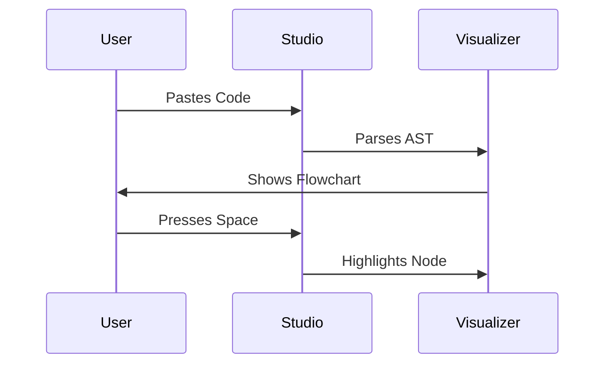
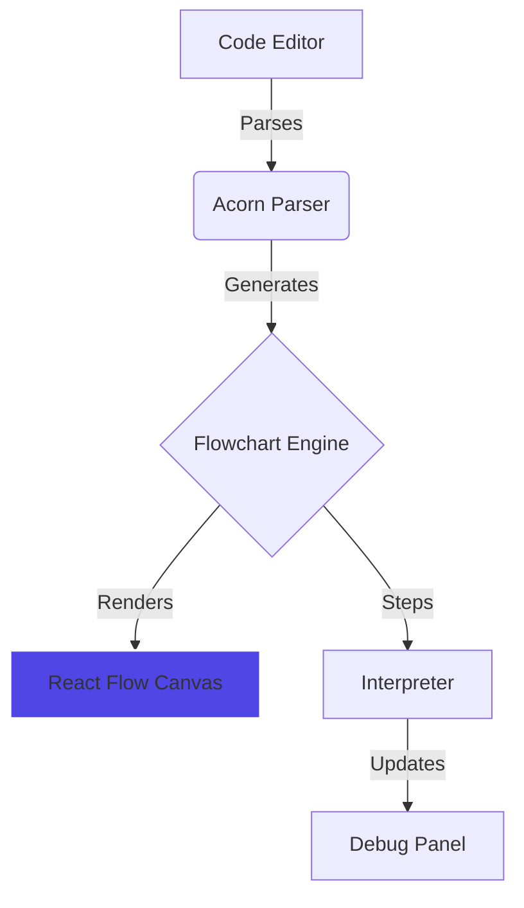

# LogicArt Getting Started Guide

**Learn to visualize and debug JavaScript code in 5 minutes**



---

```callout
LogicArt is designed for "Vibe Coders" who want to lead the Agent through structural intent rather than just typing lines of code.
```

---

## 🎯 What You'll Learn

By the end of this guide, you'll know how to:
- ✅ Visualize any JavaScript function as a flowchart
- ✅ Step through code execution line by line
- ✅ Track variable values in real-time
- ✅ Set breakpoints for debugging
- ✅ Share flowcharts with your team

---

## 🚀 Quick Start (2 Minutes)

### Step 1: Open LogicArt Studio

Navigate to [LogicArt Studio](https://logicart.studio) *(or your deployed URL)*

### Step 2: Paste Code

Copy this example and paste it into the code editor:

```javascript
function findMax(numbers) {
  let max = numbers[0];
  
  for (let i = 1; i < numbers.length; i++) {
    if (numbers[i] > max) {
      max = numbers[i];
    }
  }
  
  return max;
}
```

### Step 3: See the Flowchart

The flowchart appears automatically in the right panel.

**✅ Expected Result:**
- Nodes for each statement (initialization, loop, comparison, return)
- Edges showing control flow
- Container nodes for the loop structure

### Step 4: Step Through Execution

Use keyboard shortcuts to control execution:

| Key | Action | What Happens |
|-----|--------|--------------|
| `Space` or `K` | Play/Pause | Auto-steps through code |
| `S` | Step Forward | Advances one node |
| `B` | Step Backward | Goes back one node |
| `R` | Reset | Returns to start |

**Try it:** Press `Space` to watch the flowchart highlight each step!



---

## 🎨 Adding Human-Readable Labels

Make your flowcharts easier to understand with custom labels.

### Without Labels (Default)

```javascript
let total = 0;
if (items.length === 0) {
  return 0;
}
```

**Flowchart shows:** `let total = 0;`, `if (items.length === 0)`, `return 0;`

### With Labels (Better!)

```javascript
// @logicart: Initialize running total
let total = 0;

// @logicart: Check if array is empty
if (items.length === 0) {
  // @logicart: Return zero for empty array
  return 0;
}

// @logicart: Calculate sum of all items
for (let i = 0; i < items.length; i++) {
  // @logicart: Add current item to total
  total += items[i];
}

// @logicart: Return final sum
return total;
```

**Flowchart shows:** "Initialize running total", "Check if array is empty", etc.

**Visual Indicator:** Labeled nodes have a **blue dot** in the corner. Hover to see original code.

```callout
Pro Tip: Use // @logicart: My Label comments to give your nodes human-readable names!
```

---

## 🔍 Understanding the Interface

### Main Components



### Debug Panel Features

The floating Debug Panel shows real-time execution state:

**Current Step Tab:**
- Step number (e.g., "Step 5/12")
- Active node label
- Current function name

**Variables Tab:**
- All tracked variables
- Current values
- Type information

**Call Stack Tab:**
- Function call hierarchy
- Current execution context

**History Tab:**
- Variable changes over time
- Timeline of execution

---

## ⌨️ Keyboard Shortcuts (Learn These!)

### Essential Shortcuts

| Key | Action | When to Use |
|-----|--------|-------------|
| `Space` or `K` | Play/Pause | Auto-step through code |
| `S` | Step Forward | Advance one node manually |
| `B` | Step Backward | Review previous steps |
| `R` | Reset | Start from beginning |

### Advanced Shortcuts

| Key | Action | When to Use |
|-----|--------|-------------|
| `F` | Fullscreen | Focus on flowchart |
| `Escape` | Exit Fullscreen | Return to normal view |
| `Ctrl/Cmd + Z` | Undo | Revert code changes |
| `Ctrl/Cmd + Y` | Redo | Reapply code changes |
| `Ctrl/Cmd + O` | Import File | Load code from file |
| `Ctrl/Cmd + S` | Export File | Save code to file |

**💡 Pro Tip:** Press `?` in LogicArt Studio to see the full shortcut reference.

---

## 🐛 Debugging with Breakpoints

### Setting Breakpoints

**Method 1: Right-click a node**
1. Right-click any flowchart node
2. Select "Set Breakpoint"
3. Node border turns red

**Method 2: Click the node border**
1. Click the left edge of a node
2. Red indicator appears

### Using Breakpoints

1. Set breakpoints on critical nodes (e.g., before a complex calculation)
2. Press `Space` to start execution
3. Execution **pauses automatically** when reaching a breakpoint
4. Inspect variables in the Debug Panel
5. Press `Space` again to continue

**Use Case Example:**
```javascript
function processOrder(order) {
  // Set breakpoint here to inspect order data
  const total = calculateTotal(order.items);
  
  // Set breakpoint here to verify total before payment
  const payment = processPayment(total);
  
  return payment;
}
```

---

## 📊 Variable Tracking

### Automatic Tracking (Static Mode)

LogicArt automatically tracks variables in your code:

```javascript
function fibonacci(n) {
  let a = 0;  // Tracked
  let b = 1;  // Tracked
  
  for (let i = 2; i <= n; i++) {  // i is tracked
    let temp = a + b;  // temp is tracked
    a = b;
    b = temp;
  }
  
  return b;
}
```

**Debug Panel shows:**
```
Variables:
  n: 5
  a: 3
  b: 5
  i: 5
  temp: 5
```

### Manual Tracking (Live Mode)

For advanced tracking with `logicart-core`:

```javascript
import { checkpoint } from 'logicart-core';

function processData(data) {
  checkpoint('process:start', { data });
  
  const result = transform(data);
  
  checkpoint('process:complete', { result });
  return result;
}
```

---

## 🎓 Try These Examples

LogicArt Studio includes built-in examples. Click the **EXAMPLES** dropdown to try:

### 1. Bubble Sort
**What it teaches:** Nested loops, array manipulation, swapping

```javascript
function bubbleSort(arr) {
  for (let i = 0; i < arr.length; i++) {
    for (let j = 0; j < arr.length - i - 1; j++) {
      if (arr[j] > arr[j + 1]) {
        [arr[j], arr[j + 1]] = [arr[j + 1], arr[j]];
      }
    }
  }
  return arr;
}
```

**Try:** Watch how the inner loop shrinks each iteration

### 2. Fibonacci (Recursive)
**What it teaches:** Recursion, base cases, call stack

```javascript
function fibonacci(n) {
  if (n <= 1) return n;
  return fibonacci(n - 1) + fibonacci(n - 2);
}
```

**Try:** Set a breakpoint on the recursive call and watch the call stack

### 3. Tic-Tac-Toe Winner Check
**What it teaches:** Complex conditionals, game logic

```javascript
function checkWinner(board) {
  // Check rows
  for (let i = 0; i < 3; i++) {
    if (board[i][0] === board[i][1] && 
        board[i][1] === board[i][2] && 
        board[i][0] !== null) {
      return board[i][0];
    }
  }
  // ... more checks
}
```

**Try:** Step through to understand the win condition logic

---

## 🔗 Sharing Flowcharts

### Create a Shareable Link

1. Click the **Share** button (top-right)
2. Add optional title: "Bubble Sort Algorithm"
3. Add optional description: "Demonstrates nested loop optimization"
4. Click **Generate Link**
5. Copy the URL

### What Recipients See

When someone opens your shared link, they get:
- ✅ Complete source code (read-only)
- ✅ Interactive flowchart
- ✅ Step-through controls
- ✅ Variable tracking
- ✅ Your title and description

**Use Cases:**
- Code reviews
- Teaching algorithms
- Documentation
- Bug reports

---

## 🤖 AI Model Arena

Get code generation help from 4 AI models simultaneously.

### How to Use

1. Click **Model Arena** in the navigation
2. Enter a prompt: *"Generate a binary search algorithm with edge case handling"*
3. Click **Submit**
4. See responses from:
   - **GPT-4o** (OpenAI)
   - **Gemini** (Google)
   - **Claude** (Anthropic)
   - **Grok** (xAI)
5. Read the **Chairman Verdict** for a synthesized recommendation

### Example Prompts

**Algorithm Generation:**
```
Generate a merge sort algorithm with detailed comments
```

**Debugging Help:**
```
Why does this function return undefined for empty arrays?
[paste your code]
```

**Optimization:**
```
How can I optimize this nested loop for better performance?
[paste your code]
```

**Code Explanation:**
```
Explain this recursive function step by step
[paste your code]
```

---

## 📱 Layout Presets

Customize your workspace with layout presets.

### Available Presets

| Preset | Layout | Best For |
|--------|--------|----------|
| **Default** | 50/50 split | Balanced view |
| **Code Focus** | 70% code, 30% flowchart | Writing code |
| **Flowchart Focus** | 30% code, 70% flowchart | Debugging |
| **Presentation** | Fullscreen flowchart | Demos, teaching |

**Access:** Click the layout icon (top-right) and select a preset

---

## 🎯 Common Workflows

### Workflow 1: Understanding New Code

1. Paste code into LogicArt Studio
2. Add `// @logicart:` labels for clarity
3. Press `Space` to auto-step through
4. Watch variable values in Debug Panel
5. Set breakpoints on confusing sections
6. Step through manually to understand

### Workflow 2: Debugging a Bug

1. Paste buggy code into LogicArt Studio
2. Set breakpoints before the suspected bug
3. Press `Space` to run to breakpoint
4. Inspect variable values
5. Step forward with `S` to find where values go wrong
6. Fix code and re-test

### Workflow 3: Teaching an Algorithm

1. Write algorithm with clear `// @logicart:` labels
2. Click **Share** to generate link
3. Send link to students
4. Students can step through at their own pace
5. They see variable changes in real-time

### Workflow 4: Code Review

1. Paste code to review
2. Add `// @logicart:` labels explaining intent
3. Step through to verify logic
4. Share link with team for discussion
5. Use Debug Panel to verify edge cases

---

## 🚀 Next Steps

### For Beginners
- ✅ Try all built-in examples
- ✅ Practice adding `// @logicart:` labels
- ✅ Learn keyboard shortcuts
- ✅ Share a flowchart with a friend

### For Developers
- ✅ Read the [Installation Guide](INSTALLATION_GUIDE.md) to add LogicArt to your projects
- ✅ Try the `logicart-embed` React component
- ✅ Explore the [API Reference](API_REFERENCE.md)

### For Teams
- ✅ Use shared flowcharts for code reviews
- ✅ Create a library of algorithm visualizations
- ✅ Use Model Arena for collaborative problem-solving

---

## 🐛 Troubleshooting

### Flowchart shows "Syntax Error"

**Cause:** Your code has a JavaScript syntax error

**Fix:**
1. Check the code editor for red underlines
2. Ensure all brackets/parentheses are balanced
3. Remove TypeScript-specific syntax (e.g., type annotations)

### Variables not showing in Debug Panel

**Cause:** Variables might be out of scope or not yet initialized

**Fix:**
1. Step forward to where variables are declared
2. Check that you're viewing the correct execution step
3. Ensure the variable is in the current function scope

### Flowchart nodes are too small

**Fix:**
1. Use the zoom controls (bottom-right of flowchart)
2. Click the "Fit View" button to auto-zoom
3. Try the "Flowchart Focus" layout preset

### Can't find a keyboard shortcut

**Fix:**
- Press `?` in LogicArt Studio to see all shortcuts
- Check the Help dialog (click `?` icon in top-right)

---

## 💡 Pro Tips

### Tip 1: Use Descriptive Checkpoint IDs
```javascript
// ❌ Bad
checkpoint('cp1', { data });
checkpoint('cp2', { result });

// ✅ Good
checkpoint('validation:start', { data });
checkpoint('validation:complete', { result });
```

### Tip 2: Snapshot Arrays
```javascript
// ❌ Bad (reference, not snapshot)
checkpoint('sort:step', { arr });

// ✅ Good (snapshot with spread)
checkpoint('sort:step', { arr: [...arr] });
```

### Tip 3: Use Breakpoints Strategically
Set breakpoints:
- Before complex calculations
- At loop boundaries
- Before/after API calls
- At error handling points

### Tip 4: Combine Labels and Checkpoints
```javascript
// @logicart: Validate user input
if (!isValid(input)) {
  checkpoint('validation:failed', { input, errors });
  return null;
}
```

---

## 📚 Additional Resources

- **[Installation Guide](INSTALLATION_GUIDE.md)** - Add LogicArt to your projects
- **[API Reference](API_REFERENCE.md)** - Complete API documentation
- **[GitHub Repository](https://github.com/JPaulGrayson/LogicArt)** - Source code and issues
- **Help Dialog** - Press `?` in LogicArt Studio

---

## 🎓 Learning Path

### Week 1: Basics
- [ ] Complete this Getting Started guide
- [ ] Try all built-in examples
- [ ] Master keyboard shortcuts
- [ ] Share your first flowchart

### Week 2: Integration
- [ ] Read the Installation Guide
- [ ] Add LogicArt to a personal project
- [ ] Create custom checkpoints
- [ ] Use breakpoints for debugging

### Week 3: Advanced
- [ ] Read the API Reference
- [ ] Try the Vite plugin
- [ ] Use Model Arena for code generation
- [ ] Create a library of reusable visualizations

---

**Made with ❤️ for Vibe Coders who learn by seeing**

**Questions?** Check the [Installation Guide](INSTALLATION_GUIDE.md) or [open an issue](https://github.com/JPaulGrayson/LogicArt/issues).
