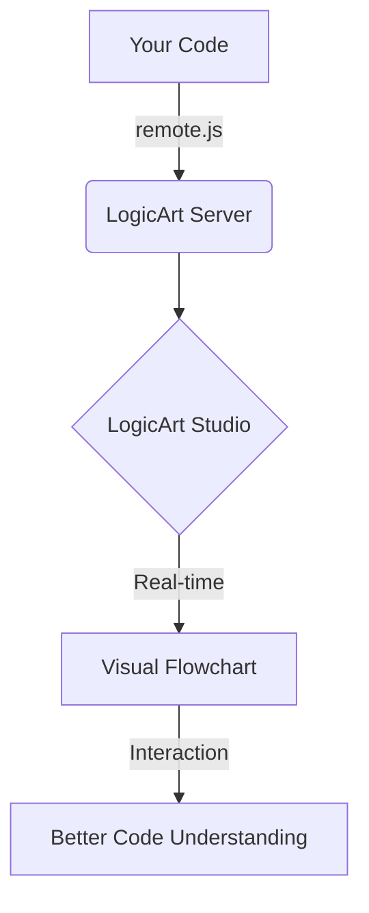
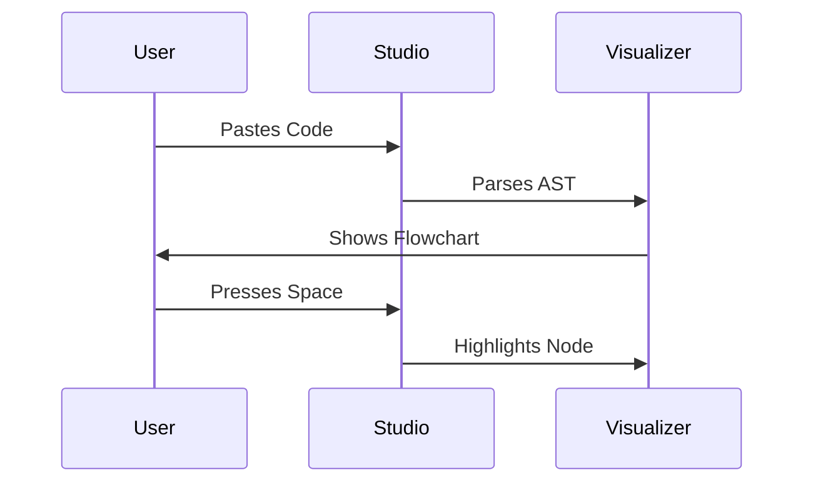
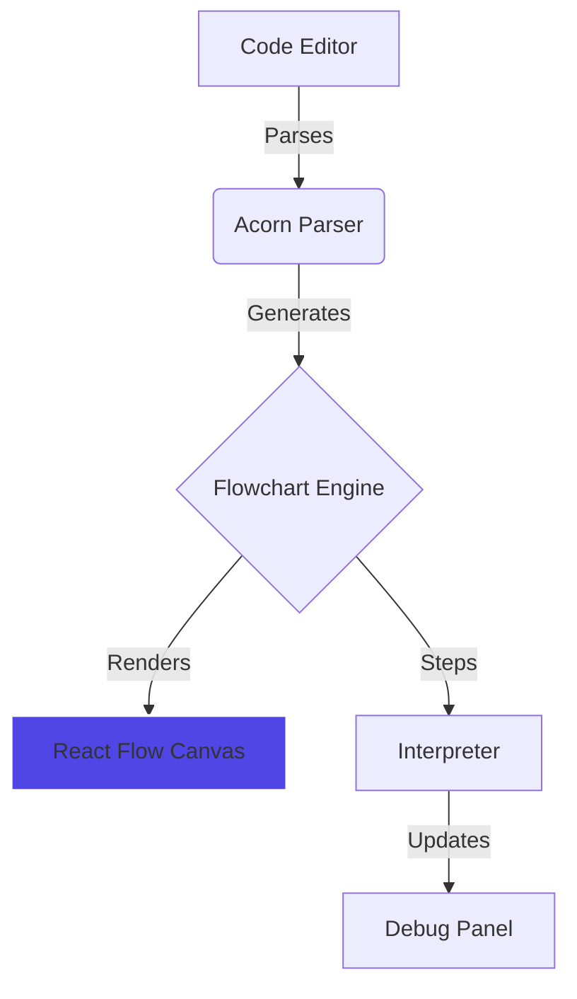

# LogicArt Help Documentation Dump
# Generated: Wed Jan  7 10:47:15 PM UTC 2026
# Files included: GETTING_STARTED.md, VIBE_CODER_GUIDE.md, AGENT_API.md, MCP_INTEGRATION_GUIDE.md, COMMON_PITFALLS.md, API_REFERENCE.md, ARENA_MASTERCLASS.md, REMOTE_SYNC_GUIDE.md, FILE_SYNC_GUIDE.md

================================================================================


================================================================================
## FILE: GETTING_STARTED.md
================================================================================

# LogicArt Getting Started Guide

**Learn to visualize and debug JavaScript code in 5 minutes**



---

```callout
LogicArt is designed for "Vibe Coders" who want to lead the Agent through structural intent rather than just typing lines of code.
```

---

## 🎯 What You'll Learn

By the end of this guide, you'll know how to:
- ✅ Visualize any JavaScript function as a flowchart
- ✅ Step through code execution line by line
- ✅ Track variable values in real-time
- ✅ Set breakpoints for debugging
- ✅ Share flowcharts with your team

---

## 🚀 Quick Start (2 Minutes)

### Step 1: Open LogicArt Studio

Navigate to [LogicArt Studio](https://logicart.studio) *(or your deployed URL)*

### Step 2: Paste Code

Copy this example and paste it into the code editor:

```javascript
function findMax(numbers) {
  let max = numbers[0];
  
  for (let i = 1; i < numbers.length; i++) {
    if (numbers[i] > max) {
      max = numbers[i];
    }
  }
  
  return max;
}
```

### Step 3: See the Flowchart

The flowchart appears automatically in the right panel.

**✅ Expected Result:**
- Nodes for each statement (initialization, loop, comparison, return)
- Edges showing control flow
- Container nodes for the loop structure

### Step 4: Step Through Execution

Use keyboard shortcuts to control execution:

| Key | Action | What Happens |
|-----|--------|--------------|
| `Space` or `K` | Play/Pause | Auto-steps through code |
| `S` | Step Forward | Advances one node |
| `B` | Step Backward | Goes back one node |
| `R` | Reset | Returns to start |

**Try it:** Press `Space` to watch the flowchart highlight each step!



---

## 🎨 Adding Human-Readable Labels

Make your flowcharts easier to understand with custom labels.

### Without Labels (Default)

```javascript
let total = 0;
if (items.length === 0) {
  return 0;
}
```

**Flowchart shows:** `let total = 0;`, `if (items.length === 0)`, `return 0;`

### With Labels (Better!)

```javascript
// @logicart: Initialize running total
let total = 0;

// @logicart: Check if array is empty
if (items.length === 0) {
  // @logicart: Return zero for empty array
  return 0;
}

// @logicart: Calculate sum of all items
for (let i = 0; i < items.length; i++) {
  // @logicart: Add current item to total
  total += items[i];
}

// @logicart: Return final sum
return total;
```

**Flowchart shows:** "Initialize running total", "Check if array is empty", etc.

**Visual Indicator:** Labeled nodes have a **blue dot** in the corner. Hover to see original code.

```callout
Pro Tip: Use // @logicart: My Label comments to give your nodes human-readable names!
```

---

## 🔍 Understanding the Interface

### Main Components



### Debug Panel Features

The floating Debug Panel shows real-time execution state:

**Current Step Tab:**
- Step number (e.g., "Step 5/12")
- Active node label
- Current function name

**Variables Tab:**
- All tracked variables
- Current values
- Type information

**Call Stack Tab:**
- Function call hierarchy
- Current execution context

**History Tab:**
- Variable changes over time
- Timeline of execution

---

## ⌨️ Keyboard Shortcuts (Learn These!)

### Essential Shortcuts

| Key | Action | When to Use |
|-----|--------|-------------|
| `Space` or `K` | Play/Pause | Auto-step through code |
| `S` | Step Forward | Advance one node manually |
| `B` | Step Backward | Review previous steps |
| `R` | Reset | Start from beginning |

### Advanced Shortcuts

| Key | Action | When to Use |
|-----|--------|-------------|
| `F` | Fullscreen | Focus on flowchart |
| `Escape` | Exit Fullscreen | Return to normal view |
| `Ctrl/Cmd + Z` | Undo | Revert code changes |
| `Ctrl/Cmd + Y` | Redo | Reapply code changes |
| `Ctrl/Cmd + O` | Import File | Load code from file |
| `Ctrl/Cmd + S` | Export File | Save code to file |

**💡 Pro Tip:** Press `?` in LogicArt Studio to see the full shortcut reference.

---

## 🐛 Debugging with Breakpoints

### Setting Breakpoints

**Method 1: Right-click a node**
1. Right-click any flowchart node
2. Select "Set Breakpoint"
3. Node border turns red

**Method 2: Click the node border**
1. Click the left edge of a node
2. Red indicator appears

### Using Breakpoints

1. Set breakpoints on critical nodes (e.g., before a complex calculation)
2. Press `Space` to start execution
3. Execution **pauses automatically** when reaching a breakpoint
4. Inspect variables in the Debug Panel
5. Press `Space` again to continue

**Use Case Example:**
```javascript
function processOrder(order) {
  // Set breakpoint here to inspect order data
  const total = calculateTotal(order.items);
  
  // Set breakpoint here to verify total before payment
  const payment = processPayment(total);
  
  return payment;
}
```

---

## 📊 Variable Tracking

### Automatic Tracking (Static Mode)

LogicArt automatically tracks variables in your code:

```javascript
function fibonacci(n) {
  let a = 0;  // Tracked
  let b = 1;  // Tracked
  
  for (let i = 2; i <= n; i++) {  // i is tracked
    let temp = a + b;  // temp is tracked
    a = b;
    b = temp;
  }
  
  return b;
}
```

**Debug Panel shows:**
```
Variables:
  n: 5
  a: 3
  b: 5
  i: 5
  temp: 5
```

### Manual Tracking (Live Mode)

For advanced tracking with `logicart-core`:

```javascript
import { checkpoint } from 'logicart-core';

function processData(data) {
  checkpoint('process:start', { data });
  
  const result = transform(data);
  
  checkpoint('process:complete', { result });
  return result;
}
```

---

## 🎓 Try These Examples

LogicArt Studio includes built-in examples. Click the **EXAMPLES** dropdown to try:

### 1. Bubble Sort
**What it teaches:** Nested loops, array manipulation, swapping

```javascript
function bubbleSort(arr) {
  for (let i = 0; i < arr.length; i++) {
    for (let j = 0; j < arr.length - i - 1; j++) {
      if (arr[j] > arr[j + 1]) {
        [arr[j], arr[j + 1]] = [arr[j + 1], arr[j]];
      }
    }
  }
  return arr;
}
```

**Try:** Watch how the inner loop shrinks each iteration

### 2. Fibonacci (Recursive)
**What it teaches:** Recursion, base cases, call stack

```javascript
function fibonacci(n) {
  if (n <= 1) return n;
  return fibonacci(n - 1) + fibonacci(n - 2);
}
```

**Try:** Set a breakpoint on the recursive call and watch the call stack

### 3. Tic-Tac-Toe Winner Check
**What it teaches:** Complex conditionals, game logic

```javascript
function checkWinner(board) {
  // Check rows
  for (let i = 0; i < 3; i++) {
    if (board[i][0] === board[i][1] && 
        board[i][1] === board[i][2] && 
        board[i][0] !== null) {
      return board[i][0];
    }
  }
  // ... more checks
}
```

**Try:** Step through to understand the win condition logic

---

## 🔗 Sharing Flowcharts

### Create a Shareable Link

1. Click the **Share** button (top-right)
2. Add optional title: "Bubble Sort Algorithm"
3. Add optional description: "Demonstrates nested loop optimization"
4. Click **Generate Link**
5. Copy the URL

### What Recipients See

When someone opens your shared link, they get:
- ✅ Complete source code (read-only)
- ✅ Interactive flowchart
- ✅ Step-through controls
- ✅ Variable tracking
- ✅ Your title and description

**Use Cases:**
- Code reviews
- Teaching algorithms
- Documentation
- Bug reports

---

## 🤖 AI Model Arena

Get code generation help from 4 AI models simultaneously.

### How to Use

1. Click **Model Arena** in the navigation
2. Enter a prompt: *"Generate a binary search algorithm with edge case handling"*
3. Click **Submit**
4. See responses from:
   - **GPT-4o** (OpenAI)
   - **Gemini** (Google)
   - **Claude** (Anthropic)
   - **Grok** (xAI)
5. Read the **Chairman Verdict** for a synthesized recommendation

### Example Prompts

**Algorithm Generation:**
```
Generate a merge sort algorithm with detailed comments
```

**Debugging Help:**
```
Why does this function return undefined for empty arrays?
[paste your code]
```

**Optimization:**
```
How can I optimize this nested loop for better performance?
[paste your code]
```

**Code Explanation:**
```
Explain this recursive function step by step
[paste your code]
```

---

## 📱 Layout Presets

Customize your workspace with layout presets.

### Available Presets

| Preset | Layout | Best For |
|--------|--------|----------|
| **Default** | 50/50 split | Balanced view |
| **Code Focus** | 70% code, 30% flowchart | Writing code |
| **Flowchart Focus** | 30% code, 70% flowchart | Debugging |
| **Presentation** | Fullscreen flowchart | Demos, teaching |

**Access:** Click the layout icon (top-right) and select a preset

---

## 🎯 Common Workflows

### Workflow 1: Understanding New Code

1. Paste code into LogicArt Studio
2. Add `// @logicart:` labels for clarity
3. Press `Space` to auto-step through
4. Watch variable values in Debug Panel
5. Set breakpoints on confusing sections
6. Step through manually to understand

### Workflow 2: Debugging a Bug

1. Paste buggy code into LogicArt Studio
2. Set breakpoints before the suspected bug
3. Press `Space` to run to breakpoint
4. Inspect variable values
5. Step forward with `S` to find where values go wrong
6. Fix code and re-test

### Workflow 3: Teaching an Algorithm

1. Write algorithm with clear `// @logicart:` labels
2. Click **Share** to generate link
3. Send link to students
4. Students can step through at their own pace
5. They see variable changes in real-time

### Workflow 4: Code Review

1. Paste code to review
2. Add `// @logicart:` labels explaining intent
3. Step through to verify logic
4. Share link with team for discussion
5. Use Debug Panel to verify edge cases

---

## 🚀 Next Steps

### For Beginners
- ✅ Try all built-in examples
- ✅ Practice adding `// @logicart:` labels
- ✅ Learn keyboard shortcuts
- ✅ Share a flowchart with a friend

### For Developers
- ✅ Read the [Installation Guide](INSTALLATION_GUIDE.md) to add LogicArt to your projects
- ✅ Try the `logicart-embed` React component
- ✅ Explore the [API Reference](API_REFERENCE.md)

### For Teams
- ✅ Use shared flowcharts for code reviews
- ✅ Create a library of algorithm visualizations
- ✅ Use Model Arena for collaborative problem-solving

---

## 🐛 Troubleshooting

### Flowchart shows "Syntax Error"

**Cause:** Your code has a JavaScript syntax error

**Fix:**
1. Check the code editor for red underlines
2. Ensure all brackets/parentheses are balanced
3. Remove TypeScript-specific syntax (e.g., type annotations)

### Variables not showing in Debug Panel

**Cause:** Variables might be out of scope or not yet initialized

**Fix:**
1. Step forward to where variables are declared
2. Check that you're viewing the correct execution step
3. Ensure the variable is in the current function scope

### Flowchart nodes are too small

**Fix:**
1. Use the zoom controls (bottom-right of flowchart)
2. Click the "Fit View" button to auto-zoom
3. Try the "Flowchart Focus" layout preset

### Can't find a keyboard shortcut

**Fix:**
- Press `?` in LogicArt Studio to see all shortcuts
- Check the Help dialog (click `?` icon in top-right)

---

## 💡 Pro Tips

### Tip 1: Use Descriptive Checkpoint IDs
```javascript
// ❌ Bad
checkpoint('cp1', { data });
checkpoint('cp2', { result });

// ✅ Good
checkpoint('validation:start', { data });
checkpoint('validation:complete', { result });
```

### Tip 2: Snapshot Arrays
```javascript
// ❌ Bad (reference, not snapshot)
checkpoint('sort:step', { arr });

// ✅ Good (snapshot with spread)
checkpoint('sort:step', { arr: [...arr] });
```

### Tip 3: Use Breakpoints Strategically
Set breakpoints:
- Before complex calculations
- At loop boundaries
- Before/after API calls
- At error handling points

### Tip 4: Combine Labels and Checkpoints
```javascript
// @logicart: Validate user input
if (!isValid(input)) {
  checkpoint('validation:failed', { input, errors });
  return null;
}
```

---

## 📚 Additional Resources

- **[Installation Guide](INSTALLATION_GUIDE.md)** - Add LogicArt to your projects
- **[API Reference](API_REFERENCE.md)** - Complete API documentation
- **[GitHub Repository](https://github.com/JPaulGrayson/LogicArt)** - Source code and issues
- **Help Dialog** - Press `?` in LogicArt Studio

---

## 🎓 Learning Path

### Week 1: Basics
- [ ] Complete this Getting Started guide
- [ ] Try all built-in examples
- [ ] Master keyboard shortcuts
- [ ] Share your first flowchart

### Week 2: Integration
- [ ] Read the Installation Guide
- [ ] Add LogicArt to a personal project
- [ ] Create custom checkpoints
- [ ] Use breakpoints for debugging

### Week 3: Advanced
- [ ] Read the API Reference
- [ ] Try the Vite plugin
- [ ] Use Model Arena for code generation
- [ ] Create a library of reusable visualizations

---

**Made with ❤️ for Vibe Coders who learn by seeing**

**Questions?** Check the [Installation Guide](INSTALLATION_GUIDE.md) or [open an issue](https://github.com/JPaulGrayson/LogicArt/issues).


================================================================================
## FILE: VIBE_CODER_GUIDE.md
================================================================================

# LogicArt Remote Mode - Vibe Coder's Guide

Connect LogicArt to any external app **without writing code yourself**. Just two simple steps!

## Step 1: Add the Script Tag

Add this single line to your app's `index.html` file, inside the `<head>` section:

```html
<script src="YOUR_LOGICART_URL/remote.js?project=MyApp"></script>
```

Replace `YOUR_LOGICART_URL` with your LogicArt app's URL (you can find this in the browser address bar when viewing LogicArt).

**Example:** Complete HTML file
```html
<!DOCTYPE html>
<html lang="en">
<head>
  <meta charset="UTF-8" />
  <meta name="viewport" content="width=device-width, initial-scale=1.0" />
  <title>My App</title>
  
  <!-- Add LogicArt Remote Mode Script -->
  <script src="https://your-logicart-app.replit.dev/remote.js?project=MyApp"></script>
</head>
<body>
  <div id="app"></div>
  
  <!-- Your app's main script -->
  <script src="./main.js"></script>
</body>
</html>
```

When your app loads, you'll see a **"View in LogicArt"** badge in the bottom-right corner. Click it to open your flowchart!

---

## Step 2: Ask Your AI Agent to Add Checkpoints

Copy this prompt and paste it into your app's AI agent (like Replit Agent):

```
Add LogicArt checkpoint() calls to track execution in my FRONTEND code only. The checkpoint() function is globally available (no import needed).

IMPORTANT: Only add checkpoints to frontend/client-side JavaScript files (React components, client utilities, etc). Do NOT add to backend/server files - the checkpoint function only works in the browser.

After adding checkpoints, ALSO register the code for flowchart visualization. Add this call somewhere in the frontend code that runs on page load:

LogicArt.registerCode(`
// Paste the main function or component with checkpoints here
function myMainFunction() {
  checkpoint('start', {});
  // ... rest of the function with checkpoints ...
}
`);

Guidelines for checkpoints:
- Add checkpoint('step-name', { key: value }) at key points
- Track user interactions: checkpoint('button-clicked', { action })
- Track state changes: checkpoint('state-update', { before, after })
- Track API calls: checkpoint('api-call', { endpoint, data })

Example:
function handleUpload(file) {
  checkpoint('upload-start', { fileName: file.name });
  // ... upload logic ...
  checkpoint('upload-complete', { success: true });
}
```

Your AI agent will:
1. Add checkpoint calls to your frontend code
2. Register the code with LogicArt so you can see the flowchart

---

## Step 3: View Your Flowchart

1. Run your app
2. Click the **"View in LogicArt"** badge in the bottom-right corner
3. You'll see two tabs:
   - **Flowchart** - Visual representation of your code with nodes lighting up as checkpoints fire
   - **Trace** - List of checkpoints in order they were called

---

## That's It!

No need to:
- Find specific files manually
- Understand code structure
- Write any code yourself

Just copy, paste, and let your AI agent do the work!

---

## Troubleshooting

**Badge doesn't appear?**
- Make sure the script tag is in the `<head>` section
- Check your browser console for any errors
- Make sure LogicArt is running

**Only seeing Trace, no Flowchart tab?**
- The AI agent needs to call `LogicArt.registerCode()` with the code
- Ask your agent: "Register the instrumented code with LogicArt using LogicArt.registerCode()"

**Checkpoints not showing?**
- Make sure your AI agent added checkpoints to **frontend** code only (not backend/server files)
- Interact with your app to trigger the code that has checkpoints
- Check that you're viewing the correct session in LogicArt

**Agent added checkpoints to backend code?**
- Ask the agent to remove them from server files
- The `checkpoint()` function only works in the browser, not on the server

**Need help?**
Click the help button (?) in LogicArt's header for more documentation.


================================================================================
## FILE: AGENT_API.md
================================================================================

# LogicArt Agent API

The Agent API provides programmatic access to LogicArt's code analysis capabilities. Use this API to integrate flowchart generation and code analysis into your tools, CI pipelines, or AI agents.

## Endpoints Overview

| Endpoint | Description |
|----------|-------------|
| `POST /api/agent/analyze` | Analyze code structure and generate flowchart data |
| `POST /api/agent/display-audit` | Detect duplicate component rendering |

---

## Code Analysis Endpoint

```
POST /api/agent/analyze
```

### Authentication

No authentication required. The API is publicly accessible.

### Request

#### Headers

```
Content-Type: application/json
```

#### Body

| Field | Type | Required | Description |
|-------|------|----------|-------------|
| `code` | string | Yes | JavaScript code to analyze |
| `language` | string | No | Language identifier (default: "javascript") |

#### Example Request

```bash
curl -X POST https://your-logicart-instance.com/api/agent/analyze \
  -H "Content-Type: application/json" \
  -d '{
    "code": "function fibonacci(n) {\n  if (n <= 1) return n;\n  return fibonacci(n - 1) + fibonacci(n - 2);\n}",
    "language": "javascript"
  }'
```

### Response

#### Success Response (200 OK)

```json
{
  "summary": {
    "nodeCount": 5,
    "complexityScore": 3,
    "entryPoint": "fibonacci"
  },
  "flow": [
    {
      "id": "node_1",
      "type": "input",
      "label": "function fibonacci(n)",
      "children": [{ "targetId": "node_2" }]
    },
    {
      "id": "node_2",
      "type": "decision",
      "label": "n <= 1",
      "children": [
        { "targetId": "node_3", "condition": "true" },
        { "targetId": "node_4", "condition": "false" }
      ]
    }
  ],
  "nodes": 5,
  "edges": 4,
  "complexity": 3,
  "language": "javascript"
}
```

#### Response Fields

| Field | Type | Description |
|-------|------|-------------|
| `summary` | object | High-level analysis summary |
| `summary.nodeCount` | number | Total number of nodes in the flowchart |
| `summary.complexityScore` | number | Cyclomatic complexity score |
| `summary.entryPoint` | string | Name of the main function |
| `flow` | array | Array of flow nodes with connections |
| `nodes` | number | Total node count |
| `edges` | number | Total edge count |
| `complexity` | number | Complexity score |
| `language` | string | Detected/specified language |

#### Flow Node Structure

Each node in the `flow` array has:

| Field | Type | Description |
|-------|------|-------------|
| `id` | string | Unique node identifier |
| `type` | string | Node type: `input`, `output`, `decision`, `default` |
| `label` | string | Display label for the node |
| `children` | array | Connections to other nodes |

---

## Display Audit Endpoint

```
POST /api/agent/display-audit
```

This endpoint helps AI agents detect when multiple code paths render the same component, preventing redundant display logic from accumulating over time.

### The Problem It Solves

When AI agents iterate on code, they often add new render statements (`return <Component />`) in different places rather than consolidating them. This leads to:

- **Code bloat** - Same component rendered from 3, 4, or more different locations
- **Maintenance burden** - Changes need to be made in multiple places
- **Inconsistent behavior** - Different code paths may render slightly different variations

### Request

#### Headers

```
Content-Type: application/json
```

#### Body

| Field | Type | Required | Description |
|-------|------|----------|-------------|
| `code` | string | Yes | JSX/JavaScript code to audit |

#### Example Request

```bash
curl -X POST https://your-logicart-instance.com/api/agent/display-audit \
  -H "Content-Type: application/json" \
  -d '{
    "code": "function Dashboard({ user }) {\n  if (!user) return <Card>Not logged in</Card>;\n  if (user.isAdmin) return <Card>Admin Panel</Card>;\n  if (user.isPremium) return <Card>Premium Dashboard</Card>;\n  return <Card>Basic Dashboard</Card>;\n}"
  }'
```

### Response

#### Success Response (200 OK)

```json
{
  "hasIssues": true,
  "pathCount": 4,
  "severity": "warning",
  "paths": [
    { "component": "Card", "line": 2 },
    { "component": "Card", "line": 3 },
    { "component": "Card", "line": 4 },
    { "component": "Card", "line": 5 }
  ],
  "suggestion": "Consider consolidating these render paths into a single return statement"
}
```

#### Response Fields

| Field | Type | Description |
|-------|------|-------------|
| `hasIssues` | boolean | Whether duplicate renders were detected |
| `pathCount` | number | Number of unique render points found |
| `severity` | string | `"none"`, `"info"`, `"warning"`, or `"critical"` |
| `paths` | array | Details of each render location |
| `paths[].component` | string | Name of the component being rendered |
| `paths[].line` | number | Line number where it's rendered |
| `suggestion` | string | Recommendation for fixing the issue |

#### Severity Thresholds

| Path Count | Severity | Meaning |
|------------|----------|---------|
| 0-2 | `none` | No issues detected |
| 3 | `info` | Minor duplication, consider reviewing |
| 4-5 | `warning` | Moderate duplication, should consolidate |
| 6+ | `critical` | High duplication, strongly recommend refactoring |

### Use Case: AI Agent Pre-Check

Before making code changes, AI agents can call this endpoint to audit existing code:

```javascript
async function checkBeforeEditing(code) {
  const audit = await fetch('/api/agent/display-audit', {
    method: 'POST',
    headers: { 'Content-Type': 'application/json' },
    body: JSON.stringify({ code })
  }).then(r => r.json());
  
  if (audit.severity === 'critical') {
    console.log('⚠️ Code has', audit.pathCount, 'render points for the same component.');
    console.log('Consider consolidating before adding more.');
  }
  
  return audit;
}
```

---

## Node Types

| Type | Description | Visual |
|------|-------------|--------|
| `input` | Function entry point | Rounded rectangle |
| `output` | Return statement | Rounded rectangle |
| `decision` | Conditional (if, while, for) | Diamond shape |
| `default` | Regular statement | Rectangle |

## Complexity Score

The complexity score is based on cyclomatic complexity:

| Score | Interpretation |
|-------|----------------|
| 1-5 | Simple, easy to understand |
| 6-10 | Moderate complexity |
| 11-20 | Complex, consider refactoring |
| 21+ | Very complex, high risk |

## Use Cases

### 1. CI/CD Integration

Analyze code complexity in your build pipeline:

```javascript
const response = await fetch('/api/agent/analyze', {
  method: 'POST',
  headers: { 'Content-Type': 'application/json' },
  body: JSON.stringify({ code: fileContents })
});

const analysis = await response.json();
if (analysis.complexity > 20) {
  console.warn('High complexity detected!');
}
```

### 2. AI Agent Integration

Provide code structure context to AI agents:

```javascript
async function analyzeForAgent(code) {
  const result = await fetch('/api/agent/analyze', {
    method: 'POST',
    headers: { 'Content-Type': 'application/json' },
    body: JSON.stringify({ code })
  }).then(r => r.json());
  
  return `Code has ${result.nodes} nodes, ${result.edges} edges, complexity: ${result.complexity}`;
}
```

### 3. Documentation Generation

Generate flowchart documentation:

```javascript
const analysis = await analyzeCode(sourceCode);
const flowchartUrl = `https://logicart.app/?code=${encodeURIComponent(sourceCode)}`;
```

## Rate Limits

Currently no rate limits are enforced. For high-volume usage, please contact the LogicArt team.

## Supported Languages

- JavaScript (ES2020)
- JSX (React components)
- More languages coming soon

## Related Endpoints

| Endpoint | Description |
|----------|-------------|
| `POST /api/share` | Create a shareable flowchart link |
| `GET /api/share/:id` | Retrieve a shared flowchart |
| `POST /api/arena/generate` | Generate code with 4 AI models |

## MCP Integration

These endpoints are also available via the Model Context Protocol (MCP). See the [MCP Integration Guide](/api/docs/mcp-guide) for connecting LogicArt to Cursor, Claude, and VS Code.

## Changelog

### V1.1 (January 2026)
- Added Display Audit endpoint (`POST /api/agent/display-audit`)
- JSX parsing support via acorn-jsx
- MCP tool `display_audit` for AI agent integration

### V1 (December 2025)
- Initial release of Agent API
- Support for JavaScript code analysis
- Flow structure and complexity scoring


================================================================================
## FILE: MCP_INTEGRATION_GUIDE.md
================================================================================

# MCP Integration Guide: Logic-Aware AI

**The "Eyes" for your LLM: Connecting LogicArt to Cursor, Claude, and VS Code.**

---

## What is MCP?

The **Model Context Protocol (MCP)** is an open standard that allows AI assistants to interact with external tools and data sources. Think of it as a "plugin system" for AI models.

With MCP, LogicArt can act as a **visual logic engine** for AI agents. Instead of the AI just "guessing" how your code works, it can call LogicArt tools to **see** the flowchart, complexity, and structure in real-time.

---

## Quick Start: Connect to Cursor

Cursor is currently the flagship platform for MCP. Follow these steps to give Cursor "Visual Logic" capabilities:

1. **Start LogicArt**: Ensure your LogicArt server is running (`npm run dev`).

2. **Open Cursor Settings**: Navigate to `Settings` → `Features` → `MCP`.

3. **Add New Server**:
   - **Name**: `LogicArt`
   - **Type**: `sse`
   - **URL**: `http://localhost:5001/api/mcp/sse`

4. **Verify**: You should see a green "Active" status and a count of 6 tools.

---

## Available Tools

LogicArt provides these "Visual Instruments" to your AI:

### 1. `analyze_code`

Primary tool for structural understanding.

- **What the AI sees**: A JSON map of every node (loop, decision, action) and their connections.
- **Use case**: *"Analyze my Dijkstra implementation and tell me where the loop exit is."*

**Input**: `{ "code": "function example() { ... }" }`

**Output**: Nodes, edges, complexity score, and entry point.

---

### 2. `get_complexity`

Calculates the "Logical Density" of a function.

- **What the AI sees**: A score from 1-100 and a breakdown of why (nesting, cyclomatic complexity).
- **Use case**: *"Is this function simple enough to maintain?"*

**Input**: `{ "code": "..." }`

**Output**: `{ "score": 15, "level": "moderate", "breakdown": {...} }`

---

### 3. `explain_flow`

A natural language summary of the logic shape.

- **What the AI sees**: A summary like *"This code contains 3 return points and 1 nested loop."*
- **Use case**: Overview of unfamiliar logic.

**Input**: `{ "code": "..." }`

**Output**: Human-readable explanation of the code structure.

---

### 4. `find_branches`

Identifies all decision points and their conditions.

- **What the AI sees**: A list of every `if`, `switch`, `for`, and `while` with their conditions.
- **Use case**: *"What conditions can cause this function to exit early?"*

**Input**: `{ "code": "..." }`

**Output**: Array of branch nodes with conditions and line numbers.

---

### 5. `count_paths`

Counts all possible execution paths through the code.

- **What the AI sees**: The total number of unique paths from entry to exit.
- **Use case**: *"How many test cases would I need for full coverage?"*

**Input**: `{ "code": "..." }`

**Output**: `{ "pathCount": 8, "isComplex": true }`

---

### 6. `display_audit`

**NEW** - Detects duplicate component rendering.

- **What the AI sees**: Whether the same component is rendered from multiple locations.
- **Use case**: *"Before I add another return statement, are there already too many?"*

This is the **key tool for preventing code bloat** when AI agents iterate on code.

**Input**: `{ "code": "function Component() { if (a) return <Card />; if (b) return <Card />; return <Card />; }" }`

**Output**:
```json
{
  "hasIssues": true,
  "pathCount": 3,
  "severity": "info",
  "paths": [
    { "component": "Card", "line": 1 },
    { "component": "Card", "line": 1 },
    { "component": "Card", "line": 1 }
  ],
  "suggestion": "Consider consolidating these render paths into a single return statement"
}
```

**Severity Levels**:
| Count | Severity | Action |
|-------|----------|--------|
| 0-2 | `none` | All good |
| 3 | `info` | Worth reviewing |
| 4-5 | `warning` | Should consolidate |
| 6+ | `critical` | Refactor immediately |

---

## How to Talk to Your AI (Best Practices)

To get the most out of the LogicArt bridge, use "Logic-First" prompts:

### Bad Prompts
- *"Explain this code."*
- *"Add a new feature."*

### Good Prompts (Visualized)

**For Understanding:**
> *"Use your LogicArt tools to analyze this code. Look at the decision nodes and tell me if I'm missing an edge case."*

**For Optimization:**
> *"Check the complexity score of this module. If it's above 10, suggest a refactoring to flatten the loops."*

**For Preventing Bloat (Display Audit):**
> *"Before adding a new return statement, use display_audit to check if this component already has too many render paths."*

**For Code Reviews:**
> *"Analyze the flow of this function. Are there any unreachable code paths?"*

---

## Technical Details

LogicArt uses the `@modelcontextprotocol/sdk` to maintain a persistent SSE connection.

| Property | Value |
|----------|-------|
| **Transport** | SSE (Server-Sent Events) |
| **Endpoint** | `/api/mcp/sse` |
| **Port** | 5001 (configurable) |
| **Security** | Localhost-only by default |
| **Protocol Version** | 1.0.0 |

### Architecture

```
┌─────────────┐         ┌─────────────────┐
│   Cursor    │   SSE   │    LogicArt     │
│   Claude    │ ◀─────▶ │    MCP Server   │
│   VS Code   │         │                 │
└─────────────┘         └────────┬────────┘
                                 │
                        ┌────────▼────────┐
                        │  Acorn Parser   │
                        │  + acorn-jsx    │
                        └─────────────────┘
```

---

## REST Alternative

All MCP tools are also available as REST endpoints:

| MCP Tool | REST Endpoint |
|----------|---------------|
| `analyze_code` | `POST /api/agent/analyze` |
| `display_audit` | `POST /api/agent/display-audit` |

---

## Troubleshooting

**"Connection refused" error**
- Ensure LogicArt server is running on port 5001
- Check that the URL matches exactly: `http://localhost:5001/api/mcp/sse`

**"0 tools available"**
- The MCP server may not have initialized. Restart the LogicArt server.

**Tools not responding**
- Check the LogicArt server console for errors
- Verify the code you're sending is valid JavaScript/JSX

---

**Happy Vibe Coding.** 🎨


================================================================================
## FILE: COMMON_PITFALLS.md
================================================================================

# LogicArt Common Pitfalls

**Avoid these common mistakes when using LogicArt**

---

## 🚨 Quick Reference

| Issue | Wrong | Right |
|-------|-------|-------|
| Checkpoint IDs | `checkpoint('cp1')` | `checkpoint('auth:login:start')` |
| Array snapshots | `{ arr }` | `{ arr: [...arr] }` |
| Async checkpoints | `checkpoint()` in async | `await checkpointAsync()` |
| CSS import | Missing | `import '@xyflow/react/dist/style.css'` |

---

## 1. Checkpoint ID Naming

### ❌ Wrong: Generic IDs

```javascript
checkpoint('cp1', { data });
checkpoint('cp2', { result });
checkpoint('step1');
checkpoint('step2');
```

**Problem:**
- Hard to understand execution flow
- Difficult to debug
- No context in logs

### ✅ Right: Hierarchical IDs

```javascript
checkpoint('validation:start', { data });
checkpoint('validation:complete', { result });
checkpoint('auth:login:start');
checkpoint('auth:login:success');
```

**Benefits:**
- Clear execution flow
- Easy to search logs
- Self-documenting

---

## 2. Array and Object References

### ❌ Wrong: Passing References

```javascript
const arr = [3, 1, 2];

for (let i = 0; i < arr.length; i++) {
  checkpoint('sort:step', { arr });  // ❌ Reference!
  // ... sorting logic
}
```

**Problem:**
- All checkpoints show the **final** array state
- Can't see intermediate changes
- Debugging is impossible

### ✅ Right: Creating Snapshots

```javascript
const arr = [3, 1, 2];

for (let i = 0; i < arr.length; i++) {
  checkpoint('sort:step', { arr: [...arr] });  // ✅ Snapshot!
  // ... sorting logic
}
```

**Benefits:**
- Each checkpoint has correct state
- Can see array changes over time
- Accurate debugging

**Also applies to objects:**

```javascript
// ❌ Wrong
checkpoint('update', { user });

// ✅ Right
checkpoint('update', { user: { ...user } });
```

---

## 3. Async/Await Checkpoints

### ❌ Wrong: Using `checkpoint()` in Async Functions

```javascript
async function fetchData() {
  checkpoint('fetch:start');  // ❌ Won't support breakpoints
  
  const data = await fetch('/api/data');
  
  checkpoint('fetch:complete', { data });  // ❌ Won't support breakpoints
  return data;
}
```

**Problem:**
- Breakpoints won't work
- Execution won't pause
- Can't debug async flow

### ✅ Right: Using `checkpointAsync()`

```javascript
async function fetchData() {
  await checkpointAsync('fetch:start');  // ✅ Supports breakpoints
  
  const data = await fetch('/api/data');
  
  await checkpointAsync('fetch:complete', { data });  // ✅ Supports breakpoints
  return data;
}
```

**Benefits:**
- Breakpoints work correctly
- Can pause async execution
- Proper async debugging

---

## 4. Missing CSS Import

### ❌ Wrong: No CSS Import

```javascript
import { LogicArtEmbed } from 'logicart-embed';

function App() {
  return <LogicArtEmbed code={code} />;  // ❌ Flowchart won't render correctly
}
```

**Problem:**
- Flowchart nodes are unstyled
- Layout is broken
- Controls don't work

### ✅ Right: Import Required CSS

```javascript
import { LogicArtEmbed } from 'logicart-embed';
import '@xyflow/react/dist/style.css';  // ✅ Required!

function App() {
  return <LogicArtEmbed code={code} />;
}
```

**Benefits:**
- Proper flowchart styling
- Correct layout
- Working controls

---

## 5. Vite Plugin Configuration

### ❌ Wrong: Missing Plugin

```javascript
// vite.config.js
import { defineConfig } from 'vite';
import react from '@vitejs/plugin-react';

export default defineConfig({
  plugins: [react()]  // ❌ No LogicArt plugin
});
```

**Problem:**
- No auto-instrumentation
- No manifest generation
- Live Mode won't work

### ✅ Right: Plugin Configured

```javascript
// vite.config.js
import { defineConfig } from 'vite';
import react from '@vitejs/plugin-react';
import logicartPlugin from 'logicart-vite-plugin';  // ✅ Import

export default defineConfig({
  plugins: [
    react(),
    logicartPlugin({  // ✅ Configure
      include: ['src/**/*.tsx', 'src/**/*.ts'],
      manifestPath: 'logicart-manifest.json'
    })
  ]
});
```

**Benefits:**
- Automatic instrumentation
- Manifest generation
- Live Mode works

---

## 6. Variable Scope in Checkpoints

### ❌ Wrong: Variables Out of Scope

```javascript
function processItems(items) {
  for (let i = 0; i < items.length; i++) {
    const item = items[i];
    processItem(item);
  }
  
  // ❌ 'item' is out of scope here!
  checkpoint('process:complete', { item });
}
```

**Problem:**
- `item` is undefined
- Can't see the data
- Confusing debug output

### ✅ Right: Capture Variables in Scope

```javascript
function processItems(items) {
  for (let i = 0; i < items.length; i++) {
    const item = items[i];
    checkpoint('process:item', { item, index: i });  // ✅ In scope
    processItem(item);
  }
  
  checkpoint('process:complete', { totalItems: items.length });  // ✅ Correct data
}
```

**Benefits:**
- All variables are defined
- Clear debug output
- Accurate tracking

---

## 7. Destructured Variables

### ❌ Wrong: Destructured Variables May Not Be Captured

```javascript
function processUser({ id, name, email }) {
  // Auto-instrumentation might not capture destructured params
  checkpoint('user:process');
}
```

**Problem:**
- Destructured variables might not be captured
- Missing data in debug panel
- Incomplete tracking

### ✅ Right: Assign to Named Variables

```javascript
function processUser(user) {
  const { id, name, email } = user;
  
  checkpoint('user:process', { 
    userId: id, 
    userName: name, 
    userEmail: email 
  });
}
```

**Benefits:**
- All variables captured
- Complete debug data
- Reliable tracking

---

## 8. TypeScript Syntax in Static Mode

### ❌ Wrong: TypeScript-Specific Syntax

```javascript
// Pasted into LogicArt Studio
function processUser(user: User): Result {  // ❌ Type annotations
  const result: Result = {  // ❌ Type annotation
    success: true
  };
  return result;
}
```

**Problem:**
- Acorn parser only supports JavaScript
- Syntax error in flowchart
- Won't visualize

### ✅ Right: Remove TypeScript Syntax

```javascript
// Pasted into LogicArt Studio
function processUser(user) {  // ✅ No type annotation
  const result = {  // ✅ No type annotation
    success: true
  };
  return result;
}
```

**Benefits:**
- Parses correctly
- Flowchart renders
- Visualization works

**Alternative:** Use the Vite plugin for TypeScript files (it handles transpilation)

---

## 9. Backend Logging Expectations

### ❌ Wrong: Expecting Visual Flowchart

```javascript
// server.ts
const LogicArt = {
  checkpoint(nodeId, options = {}) {
    console.log(`[LogicArt] ${nodeId}`, JSON.stringify(options.variables));
  }
};

// ❌ Expecting flowchart to appear automatically
app.post('/api/order', async (req, res) => {
  LogicArt.checkpoint('order:start', { variables: req.body });
  // ...
});
```

**Problem:**
- Backend logging only outputs to console
- No automatic flowchart visualization
- Misunderstood feature

### ✅ Right: Understand Backend Logging

```javascript
// server.ts
const LogicArt = {
  checkpoint(nodeId, options = {}) {
    console.log(`[LogicArt] ${nodeId}`, JSON.stringify(options.variables));
  }
};

app.post('/api/order', async (req, res) => {
  LogicArt.checkpoint('order:start', { variables: req.body });
  // ...
});

// ✅ To see flowchart:
// 1. Copy server code
// 2. Paste into LogicArt Studio
// 3. See flowchart structure
// 4. Correlate with console logs
```

**Benefits:**
- Correct expectations
- Proper workflow
- Effective debugging

---

## 10. Manifest URL Path

### ❌ Wrong: Incorrect Manifest Path

```javascript
<LogicArtEmbed manifestUrl="logicart-manifest.json" />  // ❌ Missing leading slash
```

**Problem:**
- Manifest not found
- 404 error
- Live Mode doesn't work

### ✅ Right: Absolute Path

```javascript
<LogicArtEmbed manifestUrl="/logicart-manifest.json" />  // ✅ Leading slash
```

**Benefits:**
- Manifest loads correctly
- Live Mode works
- No 404 errors

---

## 11. Checkpoint Overload

### ❌ Wrong: Too Many Checkpoints

```javascript
function processArray(arr) {
  checkpoint('start');
  checkpoint('check-length');
  
  for (let i = 0; i < arr.length; i++) {
    checkpoint('loop-start');
    checkpoint('get-item');
    const item = arr[i];
    checkpoint('got-item');
    checkpoint('process-start');
    processItem(item);
    checkpoint('process-end');
    checkpoint('loop-end');
  }
  
  checkpoint('end');
}
```

**Problem:**
- Too many checkpoints
- Cluttered flowchart
- Hard to follow
- Performance impact

### ✅ Right: Strategic Checkpoints

```javascript
function processArray(arr) {
  checkpoint('process:start', { totalItems: arr.length });
  
  for (let i = 0; i < arr.length; i++) {
    checkpoint('process:item', { 
      index: i, 
      item: arr[i],
      progress: `${i + 1}/${arr.length}`
    });
    processItem(arr[i]);
  }
  
  checkpoint('process:complete', { processedCount: arr.length });
}
```

**Benefits:**
- Clear execution flow
- Readable flowchart
- Better performance
- Easier debugging

---

## 12. User Labels Placement

### ❌ Wrong: Label After Code

```javascript
let count = 0;
// @logicart: Initialize counter  // ❌ Label after code
```

**Problem:**
- Label won't be applied
- Node shows code instead
- Confusing flowchart

### ✅ Right: Label Before Code

```javascript
// @logicart: Initialize counter  // ✅ Label before code
let count = 0;
```

**Benefits:**
- Label appears in flowchart
- Clear node descriptions
- Better readability

---

## 🎯 Quick Checklist

Before you start using LogicArt, verify:

- [ ] Checkpoint IDs are hierarchical (`section:action:detail`)
- [ ] Arrays/objects are snapshotted (`[...arr]`, `{...obj}`)
- [ ] Async functions use `checkpointAsync()`
- [ ] CSS is imported (`import '@xyflow/react/dist/style.css'`)
- [ ] Vite plugin is configured (if using Live Mode)
- [ ] Variables are in scope when captured
- [ ] TypeScript syntax is removed (for Static Mode)
- [ ] Backend logging expectations are correct
- [ ] Manifest URL has leading slash
- [ ] Checkpoints are strategic, not excessive
- [ ] User labels are placed before code

---

## 📚 Additional Resources

- **[Getting Started Guide](GETTING_STARTED.md)** - Tutorials and workflows
- **[Installation Guide](INSTALLATION_GUIDE.md)** - Platform-specific setup
- **[API Reference](API_REFERENCE.md)** - Complete API documentation

---

**Made with ❤️ for Vibe Coders who learn by seeing**


================================================================================
## FILE: API_REFERENCE.md
================================================================================

# LogicArt API Reference

**Complete API documentation for LogicArt packages and components**

---

## 📦 Package Overview

| Package | Purpose | Version |
|---------|---------|---------|
| **logicart-core** | Runtime library for checkpoint debugging | 1.0.0 |
| **logicart-embed** | React component for flowchart visualization | 1.0.0 |
| **logicart-vite-plugin** | Vite plugin for build-time instrumentation | 1.0.0 |

---

## Table of Contents

- [logicart-core](#logicart-core)
  - [checkpoint()](#checkpoint)
  - [checkpointAsync()](#checkpointasync)
  - [LogicArtRuntime](#logicartruntime)
- [logicart-embed](#logicart-embed)
  - [LogicArtEmbed Component](#logicart-embed-component)
  - [Props Reference](#props-reference)
- [logicart-vite-plugin](#logicart-vite-plugin)
  - [Plugin Configuration](#plugin-configuration)
  - [Options Reference](#options-reference)
- [User Labels](#user-labels)
- [Checkpoint ID Conventions](#checkpoint-id-conventions)
- [Type Definitions](#type-definitions)

---

## logicart-core

Runtime library for checkpoint-based debugging and execution tracking.

### Installation

```bash
npm install logicart-core
```

### Compatibility

- **Node.js**: 16+
- **React**: 16+
- **Browsers**: Chrome 90+, Firefox 88+, Safari 14+

---

### checkpoint()

Record a synchronous checkpoint during code execution.

**Signature:**
```typescript
function checkpoint(
  nodeId: string,
  variables?: Record<string, any>
): void
```

**Parameters:**

| Parameter | Type | Required | Description |
|-----------|------|----------|-------------|
| `nodeId` | string | ✅ | Unique identifier for this checkpoint |
| `variables` | object | ❌ | Variables to capture at this point |

**Example:**

```javascript
import { checkpoint } from 'logicart-core';

function processOrder(order) {
  checkpoint('order:start', { orderId: order.id });
  
  const total = calculateTotal(order.items);
  checkpoint('order:total', { total });
  
  if (total > 1000) {
    checkpoint('order:large', { total });
    applyDiscount(order);
  }
  
  checkpoint('order:complete', { finalTotal: order.total });
  return order;
}
```

**Best Practices:**

```javascript
// ✅ Good: Descriptive IDs
checkpoint('validation:email', { email });
checkpoint('auth:login:success', { userId });

// ❌ Bad: Generic IDs
checkpoint('cp1', { data });
checkpoint('step2', { result });

// ✅ Good: Snapshot arrays
checkpoint('sort:step', { arr: [...arr] });

// ❌ Bad: Reference (will change)
checkpoint('sort:step', { arr });
```

**Returns:** `void`

---

### checkpointAsync()

Record an asynchronous checkpoint with breakpoint support.

**Signature:**
```typescript
async function checkpointAsync(
  nodeId: string,
  variables?: Record<string, any>
): Promise<void>
```

**Parameters:**

| Parameter | Type | Required | Description |
|-----------|------|----------|-------------|
| `nodeId` | string | ✅ | Unique identifier for this checkpoint |
| `variables` | object | ❌ | Variables to capture at this point |

**Example:**

```javascript
import { checkpointAsync, LogicArtRuntime } from 'logicart-core';

const runtime = new LogicArtRuntime();
runtime.setBreakpoint('critical_point', true);

async function processData(data) {
  await checkpointAsync('process:start', { data });
  
  // Execution pauses here if breakpoint is set
  await checkpointAsync('critical_point', { data });
  
  const result = await transform(data);
  
  await checkpointAsync('process:complete', { result });
  return result;
}

// Resume execution
runtime.resume();
```

**Breakpoint Behavior:**

When a breakpoint is set on a checkpoint:
1. Execution pauses at the checkpoint
2. Variables are captured and sent to LogicArt Studio
3. Execution waits for `runtime.resume()` to be called
4. Execution continues to next checkpoint

**Returns:** `Promise<void>`

---

### LogicArtRuntime

Runtime controller for managing execution sessions, breakpoints, and checkpoints.

**Signature:**
```typescript
class LogicArtRuntime {
  constructor(options?: RuntimeOptions);
  
  // Session control
  start(): void;
  end(): void;
  
  // Checkpoints
  checkpoint(nodeId: string, variables?: Record<string, any>): void;
  
  // Breakpoints
  setBreakpoint(nodeId: string, enabled: boolean): void;
  removeBreakpoint(nodeId: string): void;
  clearBreakpoints(): void;
  
  // Execution control
  resume(): void;
}
```

**Constructor Options:**

```typescript
interface RuntimeOptions {
  manifestHash?: string;  // Hash of the manifest for session tracking
  debug?: boolean;        // Enable debug logging
}
```

**Example:**

```javascript
import { LogicArtRuntime } from 'logicart-core';

const runtime = new LogicArtRuntime({
  manifestHash: 'abc123',
  debug: true
});

// Start session
runtime.start();

// Set breakpoints
runtime.setBreakpoint('critical_point', true);
runtime.setBreakpoint('error_handler', true);

// Record checkpoints
runtime.checkpoint('init', { config });
runtime.checkpoint('processing', { data });

// Remove specific breakpoint
runtime.removeBreakpoint('error_handler');

// Clear all breakpoints
runtime.clearBreakpoints();

// Resume from breakpoint
runtime.resume();

// End session
runtime.end();
```

**Methods:**

#### `start()`
Begin a new execution session.

```javascript
runtime.start();
```

#### `end()`
End the current execution session.

```javascript
runtime.end();
```

#### `checkpoint(nodeId, variables)`
Record a checkpoint (same as standalone `checkpoint()` function).

```javascript
runtime.checkpoint('process:step', { index: i });
```

#### `setBreakpoint(nodeId, enabled)`
Enable or disable a breakpoint at a specific checkpoint.

```javascript
runtime.setBreakpoint('critical_point', true);   // Enable
runtime.setBreakpoint('critical_point', false);  // Disable
```

#### `removeBreakpoint(nodeId)`
Remove a breakpoint completely.

```javascript
runtime.removeBreakpoint('critical_point');
```

#### `clearBreakpoints()`
Remove all breakpoints.

```javascript
runtime.clearBreakpoints();
```

#### `resume()`
Resume execution from a breakpoint.

```javascript
runtime.resume();
```

---

## logicart-embed

React component for embedding flowchart visualization in your applications.

### Installation

```bash
npm install logicart-embed
```

### Required CSS

```javascript
import '@xyflow/react/dist/style.css';
```

### Compatibility

- **React**: 16+
- **Browsers**: Chrome 90+, Firefox 88+, Safari 14+

---

### LogicArtEmbed Component

Embeddable React component for flowchart visualization.

**Signature:**
```typescript
function LogicArtEmbed(props: LogicArtEmbedProps): JSX.Element
```

**Basic Example:**

```javascript
import { LogicArtEmbed } from 'logicart-embed';
import '@xyflow/react/dist/style.css';

function App() {
  const code = `
    function factorial(n) {
      if (n <= 1) return 1;
      return n * factorial(n - 1);
    }
  `;
  
  return <LogicArtEmbed code={code} theme="dark" />;
}
```

**Advanced Example:**

```javascript
import { LogicArtEmbed } from 'logicart-embed';
import { useState } from 'react';

function AlgorithmVisualizer() {
  const [code, setCode] = useState('');
  
  const handleNodeClick = (nodeId) => {
    console.log('Clicked node:', nodeId);
  };
  
  return (
    <div>
      <textarea onChange={(e) => setCode(e.target.value)} />
      
      <LogicArtEmbed
        code={code}
        theme="dark"
        position="bottom-right"
        showVariables={true}
        showHistory={true}
        defaultOpen={true}
        onNodeClick={handleNodeClick}
      />
    </div>
  );
}
```

---

### Props Reference

#### Core Props

| Prop | Type | Default | Description |
|------|------|---------|-------------|
| `code` | string | - | JavaScript code to visualize (Static Mode) |
| `manifestUrl` | string | - | URL to manifest file (Live Mode) |
| `manifestHash` | string | - | Hash of manifest for session tracking |

**Note:** Provide either `code` (Static Mode) OR `manifestUrl` (Live Mode), not both.

#### Appearance Props

| Prop | Type | Default | Description |
|------|------|---------|-------------|
| `theme` | `'dark'` \| `'light'` | `'dark'` | Color theme |
| `position` | string | `'bottom-right'` | Panel position (CSS position value) |
| `defaultOpen` | boolean | `false` | Open panel by default |

#### Feature Props

| Prop | Type | Default | Description |
|------|------|---------|-------------|
| `showVariables` | boolean | `true` | Show variable inspector |
| `showHistory` | boolean | `false` | Show checkpoint history |
| `showCallStack` | boolean | `true` | Show call stack |

#### Event Props

| Prop | Type | Default | Description |
|------|------|---------|-------------|
| `onNodeClick` | function | - | Callback when node is clicked |
| `onStepChange` | function | - | Callback when execution step changes |
| `onBreakpoint` | function | - | Callback when breakpoint is hit |

---

### Prop Details

#### `code`

JavaScript code to visualize in Static Mode.

```javascript
<LogicArtEmbed
  code={`
    function bubbleSort(arr) {
      for (let i = 0; i < arr.length; i++) {
        for (let j = 0; j < arr.length - i - 1; j++) {
          if (arr[j] > arr[j + 1]) {
            [arr[j], arr[j + 1]] = [arr[j + 1], arr[j]];
          }
        }
      }
      return arr;
    }
  `}
/>
```

**Type:** `string`  
**Required:** Only if `manifestUrl` is not provided

---

#### `manifestUrl`

URL to the manifest file for Live Mode.

```javascript
<LogicArtEmbed manifestUrl="/logicart-manifest.json" />
```

**Type:** `string`  
**Required:** Only if `code` is not provided

**Manifest Format:**
```json
{
  "hash": "abc123",
  "nodes": [...],
  "edges": [...],
  "checkpoints": [...]
}
```

---

#### `theme`

Color theme for the flowchart.

```javascript
<LogicArtEmbed code={code} theme="dark" />
<LogicArtEmbed code={code} theme="light" />
```

**Type:** `'dark' | 'light'`  
**Default:** `'dark'`

---

#### `position`

CSS position for the floating panel.

```javascript
<LogicArtEmbed code={code} position="bottom-right" />
<LogicArtEmbed code={code} position="top-left" />
<LogicArtEmbed code={code} position="fixed" />
```

**Type:** `string`  
**Default:** `'bottom-right'`

**Common values:**
- `'bottom-right'`
- `'bottom-left'`
- `'top-right'`
- `'top-left'`
- `'fixed'` (custom positioning with CSS)

---

#### `showVariables`

Show the variable inspector in the Debug Panel.

```javascript
<LogicArtEmbed code={code} showVariables={true} />
```

**Type:** `boolean`  
**Default:** `true`

**When enabled:**
- Variables tab appears in Debug Panel
- Current variable values are displayed
- Variable types are shown

---

#### `showHistory`

Show the checkpoint history timeline.

```javascript
<LogicArtEmbed code={code} showHistory={true} />
```

**Type:** `boolean`  
**Default:** `false`

**When enabled:**
- History tab appears in Debug Panel
- Timeline of all checkpoints
- Variable changes over time

---

#### `onNodeClick`

Callback when a flowchart node is clicked.

```javascript
<LogicArtEmbed
  code={code}
  onNodeClick={(nodeId) => {
    console.log('Clicked node:', nodeId);
    // Jump to source code, highlight line, etc.
  }}
/>
```

**Type:** `(nodeId: string) => void`  
**Default:** `undefined`

**Parameters:**
- `nodeId`: Unique identifier of the clicked node

---

#### `onStepChange`

Callback when execution step changes.

```javascript
<LogicArtEmbed
  code={code}
  onStepChange={(step, totalSteps) => {
    console.log(`Step ${step} of ${totalSteps}`);
  }}
/>
```

**Type:** `(step: number, totalSteps: number) => void`  
**Default:** `undefined`

**Parameters:**
- `step`: Current step number (1-indexed)
- `totalSteps`: Total number of steps

---

#### `onBreakpoint`

Callback when a breakpoint is hit.

```javascript
<LogicArtEmbed
  code={code}
  onBreakpoint={(nodeId, variables) => {
    console.log('Breakpoint hit:', nodeId, variables);
  }}
/>
```

**Type:** `(nodeId: string, variables: Record<string, any>) => void`  
**Default:** `undefined`

**Parameters:**
- `nodeId`: Checkpoint ID where breakpoint was hit
- `variables`: Current variable values

---

## logicart-vite-plugin

Vite plugin for automatic build-time instrumentation.

### Installation

```bash
npm install logicart-vite-plugin --save-dev
```

### Compatibility

- **Vite**: 4+
- **Node.js**: 16+

---

### Plugin Configuration

Add to `vite.config.js`:

```javascript
import { defineConfig } from 'vite';
import react from '@vitejs/plugin-react';
import logicartPlugin from 'logicart-vite-plugin';

export default defineConfig({
  plugins: [
    react(),
    logicartPlugin({
      include: ['src/**/*.tsx', 'src/**/*.ts'],
      exclude: ['**/node_modules/**', '**/*.test.*'],
      manifestPath: 'logicart-manifest.json',
      autoInstrument: true,
      captureVariables: true
    })
  ]
});
```

---

### Options Reference

| Option | Type | Default | Description |
|--------|------|---------|-------------|
| `include` | string[] | `['**/*.js', '**/*.ts']` | Glob patterns for files to instrument |
| `exclude` | string[] | `['/node_modules/']` | Glob patterns for files to skip |
| `manifestPath` | string | `'logicart-manifest.json'` | Output path for manifest file |
| `autoInstrument` | boolean | `true` | Automatically inject checkpoints |
| `captureVariables` | boolean | `true` | Capture local variables at checkpoints |

---

### Option Details

#### `include`

Glob patterns for files to instrument.

```javascript
logicartPlugin({
  include: [
    'src/**/*.tsx',
    'src/**/*.ts',
    'src/**/*.jsx',
    'src/**/*.js'
  ]
})
```

**Type:** `string[]`  
**Default:** `['**/*.js', '**/*.ts', '**/*.jsx', '**/*.tsx']`

**Common patterns:**
- `'src/**/*.ts'` - All TypeScript files in src/
- `'**/*.js'` - All JavaScript files
- `'src/components/**/*'` - All files in components/

---

#### `exclude`

Glob patterns for files to skip.

```javascript
logicartPlugin({
  exclude: [
    '**/node_modules/**',
    '**/*.test.*',
    '**/*.spec.*',
    '**/dist/**'
  ]
})
```

**Type:** `string[]`  
**Default:** `['/node_modules/']`

**Common patterns:**
- `'**/node_modules/**'` - Exclude dependencies
- `'**/*.test.*'` - Exclude test files
- `'**/dist/**'` - Exclude build output

---

#### `manifestPath`

Output path for the generated manifest file.

```javascript
logicartPlugin({
  manifestPath: 'public/logicart-manifest.json'
})
```

**Type:** `string`  
**Default:** `'logicart-manifest.json'`

**Manifest structure:**
```json
{
  "hash": "abc123",
  "files": {
    "src/App.tsx": {
      "nodes": [...],
      "edges": [...],
      "checkpoints": [...]
    }
  }
}
```

---

#### `autoInstrument`

Automatically inject checkpoint calls at key points.

```javascript
logicartPlugin({
  autoInstrument: true
})
```

**Type:** `boolean`  
**Default:** `true`

**When enabled:**
- Checkpoints injected at function entries
- Checkpoints injected at control flow points (if, for, while)
- Checkpoints injected at return statements

**Example transformation:**

**Before:**
```javascript
function processOrder(order) {
  if (!order.valid) {
    return null;
  }
  return order;
}
```

**After:**
```javascript
function processOrder(order) {
  LogicArt.checkpoint('processOrder:entry', { order });
  
  if (!order.valid) {
    LogicArt.checkpoint('processOrder:invalid', { order });
    return null;
  }
  
  LogicArt.checkpoint('processOrder:return', { order });
  return order;
}
```

---

#### `captureVariables`

Capture local variables at each checkpoint.

```javascript
logicartPlugin({
  captureVariables: true
})
```

**Type:** `boolean`  
**Default:** `true`

**When enabled:**
- All local variables are captured
- Function parameters are captured
- Variable values are sent to LogicArt Studio

**When disabled:**
- Only checkpoint IDs are recorded
- No variable data is captured
- Smaller manifest file

---

## 🌉 Bridge & Model Integration

Documentation for connecting LogicArt to external AI models and IDE platforms (Cursor, VS Code).

### Model Context Protocol (MCP)

LogicArt serves as a standard MCP server, allowing any AI model (Claude 3.5, GPT-4o) to "see" and "analyze" your code structure through LogicArt's logic engine.

**Endpoint:** `http://localhost:5001/api/mcp/sse`

#### Available Tools:

| Tool | Parameters | Description |
|------|------------|-------------|
| `analyze_code` | `code: string` | Returns a full JSON map of nodes and edges. |
| `get_complexity` | `code: string` | Returns a complexity score (1-100) and refactoring advice. |
| `explain_flow` | `code: string` | Returns a natural language summary of the logic paths. |
| `find_branches` | `code: string` | Lists all conditional logic points and their current state. |

**Example (Cursor Setup):**
1. Open Cursor Settings -> Features -> MCP.
2. Add New MCP Server.
3. Type: `sse`, Name: `LogicArt`.
4. URL: `http://localhost:5001/api/mcp/sse`.

---

### Remote Mode API

Sync local IDE activity to the LogicArt Workbench in real-time.

#### `POST /api/remote/session`
Create a new telepresence session for an active file.

**Request:**
```json
{
  "name": "MyComponent.tsx",
  "code": "function start() { ... }"
}
```

**Response:**
```json
{
  "sessionId": "abc-123",
  "connectUrl": "http://localhost:5001/remote/abc-123"
}
```

#### `POST /api/remote/checkpoint`
Send a live execution event to a remote session.

```json
{
  "sessionId": "abc-123",
  "checkpoint": {
    "nodeId": "auth:success",
    "variables": { "userId": 42 }
  }
}
```

---

### Agent Bridge API

Programmatic analysis for custom Agent workflows.

#### `POST /api/agent/analyze`
High-speed structural analysis for context injection.

**Request:**
```json
{
  "code": "const x = 10;",
  "language": "javascript"
}
```

**Response:**
```json
{
  "summary": { "nodeCount": 1, "complexityScore": 0 },
  "flow": [...],
  "nodes": 1,
  "edges": 0
}
```

---

### Model Arena API

Comparative analysis and model benchmarking endpoints.

#### `POST /api/arena/generate`
Generate code across 4 specific model providers simultaneously.

**Request:**
```json
{
  "prompt": "Write a binary search."
}
```

**Response:**
```json
{
  "results": [
    { "provider": "OpenAI", "code": "...", "latencyMs": 450 },
    { "provider": "Claude", "code": "...", "latencyMs": 620 }
  ],
  "comparison": { "similarityMatrix": [...] }
}
```

#### `POST /api/arena/verdict`
Determine which model's output is superior using an LLM Chairman.

**Request:**
```json
{
  "mode": "code",
  "chairman": "openai",
  "originalPrompt": "Write a binary search.",
  "results": [...]
}
```

---

## User Labels

Add human-readable labels to flowchart nodes with `// @logicart:` comments.

### Syntax

```javascript
// @logicart: Your label here
<code statement>
```

### Examples

**Basic Labels:**

```javascript
// @logicart: Initialize counter
let count = 0;

// @logicart: Check if array is empty
if (items.length === 0) {
  // @logicart: Return zero for empty array
  return 0;
}

// @logicart: Sum all items
for (const item of items) {
  count += item.value;
}

// @logicart: Return final sum
return count;
```

**Labels in Complex Logic:**

```javascript
function processOrder(order) {
  // @logicart: Validate order data
  if (!validateOrder(order)) {
    // @logicart: Log validation failure
    console.error('Invalid order');
    
    // @logicart: Return error response
    return { success: false, error: 'Invalid order' };
  }
  
  // @logicart: Calculate order total
  const total = calculateTotal(order.items);
  
  // @logicart: Apply discount if eligible
  if (total > 100) {
    // @logicart: Reduce total by 10%
    total *= 0.9;
  }
  
  // @logicart: Process payment
  const payment = processPayment(total);
  
  // @logicart: Return success response
  return { success: true, payment };
}
```

### Visual Indicator

Labeled nodes show a **blue dot** indicator in the flowchart.

**Hover behavior:**
- Hover over a labeled node
- Tooltip shows the original code
- Label remains visible in the node

### Best Practices

```javascript
// ✅ Good: Descriptive, explains intent
// @logicart: Validate email format
if (!isValidEmail(email)) { ... }

// ❌ Bad: Just repeats the code
// @logicart: If not valid email
if (!isValidEmail(email)) { ... }

// ✅ Good: Explains business logic
// @logicart: Apply 10% discount for orders over $100
if (total > 100) { total *= 0.9; }

// ❌ Bad: Too vague
// @logicart: Discount
if (total > 100) { total *= 0.9; }
```

---

## Checkpoint ID Conventions

Use hierarchical naming for organized debugging.

### Format

```
section:action:detail
```

### Examples

**Authentication:**
```javascript
checkpoint('auth:login:start');
checkpoint('auth:login:validate');
checkpoint('auth:login:success');
checkpoint('auth:login:failure');
checkpoint('auth:logout');
```

**API Requests:**
```javascript
checkpoint('api:request:users');
checkpoint('api:response:success');
checkpoint('api:response:error');
checkpoint('api:retry:attempt', { attemptNumber });
```

**Data Processing:**
```javascript
checkpoint('process:start', { dataSize });
checkpoint('process:validate');
checkpoint('process:transform');
checkpoint('process:complete', { result });
```

**Loops:**
```javascript
checkpoint('loop:start', { totalItems });
checkpoint('loop:iteration', { index, item });
checkpoint('loop:complete', { processedCount });
```

**Error Handling:**
```javascript
checkpoint('error:caught', { error });
checkpoint('error:logged');
checkpoint('error:recovered');
```

### Best Practices

```javascript
// ✅ Good: Hierarchical, descriptive
checkpoint('order:payment:start', { amount });
checkpoint('order:payment:success', { transactionId });

// ❌ Bad: Flat, generic
checkpoint('payment1', { amount });
checkpoint('payment2', { transactionId });

// ✅ Good: Includes context
checkpoint('batch:item:process', { 
  index: i, 
  itemId: item.id,
  progress: `${i + 1}/${total}`
});

// ❌ Bad: Missing context
checkpoint('process', { i });
```

---

## Type Definitions

### TypeScript Types

```typescript
// logicart-core
declare module 'logicart-core' {
  export function checkpoint(
    nodeId: string,
    variables?: Record<string, any>
  ): void;
  
  export function checkpointAsync(
    nodeId: string,
    variables?: Record<string, any>
  ): Promise<void>;
  
  export class LogicArtRuntime {
    constructor(options?: RuntimeOptions);
    start(): void;
    end(): void;
    checkpoint(nodeId: string, variables?: Record<string, any>): void;
    setBreakpoint(nodeId: string, enabled: boolean): void;
    removeBreakpoint(nodeId: string): void;
    clearBreakpoints(): void;
    resume(): void;
  }
  
  export interface RuntimeOptions {
    manifestHash?: string;
    debug?: boolean;
  }
}

// logicart-embed
declare module 'logicart-embed' {
  export interface LogicArtEmbedProps {
    code?: string;
    manifestUrl?: string;
    manifestHash?: string;
    theme?: 'dark' | 'light';
    position?: string;
    showVariables?: boolean;
    showHistory?: boolean;
    showCallStack?: boolean;
    defaultOpen?: boolean;
    onNodeClick?: (nodeId: string) => void;
    onStepChange?: (step: number, totalSteps: number) => void;
    onBreakpoint?: (nodeId: string, variables: Record<string, any>) => void;
  }
  
  export function LogicArtEmbed(props: LogicArtEmbedProps): JSX.Element;
}

// logicart-vite-plugin
declare module 'logicart-vite-plugin' {
  export interface LogicArtPluginOptions {
    include?: string[];
    exclude?: string[];
    manifestPath?: string;
    autoInstrument?: boolean;
    captureVariables?: boolean;
  }
  
  export default function logicartPlugin(
    options?: LogicArtPluginOptions
  ): Plugin;
}
```

---

## 📚 Additional Resources

- **[Getting Started Guide](GETTING_STARTED.md)** - Tutorials and examples
- **[Installation Guide](INSTALLATION_GUIDE.md)** - Platform-specific setup
- **[GitHub Repository](https://github.com/JPaulGrayson/LogicArt)** - Source code

---

**Made with ❤️ for Vibe Coders who learn by seeing**


================================================================================
## FILE: ARENA_MASTERCLASS.md
================================================================================

# Arena Masterclass: The Council of 4
**Mastering multi-model generation and competitive debugging in LogicArt Studio.**

---

## 🏛 The "Council" Concept
The LogicArt Arena is not just a chat box—it's a **Logic Benchmark**. By prompting four distinct AI architectures (GPT-4o, Gemini 1.5, Claude 3.5, and Grok 4) simultaneously, you can see the "Structural Consensus" of an algorithm.

---

## ⚡ Model Arena (Creation Mode)
Use this mode to generate code from scratch and compare how different models think about control flow.

### 1. The Power Prompt
The best Arena results come from **Structural Constraints**. 
*   **Bad**: *"Write a sorting algorithm."*
*   **Masterclass**: *"Create a merge sort that uses an in-place buffer. Prioritize shallow recursion and include @logicart labels for each partition step."*

### 2. Comparative Visualization
Once the "Council" responds, don't just read the code—**scroll the flowcharts**.
*   **Gemini** often produces flatter, more imperative logic.
*   **Claude** tends toward elegant, functional recursion.
*   **GPT-4o** usually balances safety and standard patterns.
*   **Visual Diff**: Look for which model created the fewest "Cognitive Jumps" (simplified edges).

### 3. The Chairman's Verdict
At the bottom of the Arena, the **LLM Chairman** analyzes all four responses. It looks for:
*   **Syntactic Completeness**: Did any model omit a semicolon or edge case?
*   **Structural Efficiency**: Which flowchart has the lowest complexity score?
*   **Consensus**: Where did 3 out of 4 models agree on an implementation?

---

## 🐞 Debug Arena (Triage Mode)
The Debug Arena is designed to solve "Impossible Bugs" by getting four independent diagnostic perspectives.

### 1. Providing Context
For the best debugging advice, provide the "Holy Trinity" of context:
1.  **The Error**: Paste the raw stack trace.
2.  **The Logic**: The function that failed.
3.  **The Environment**: Mention if it's running in Node, a Browser, or LogicArt.

### 2. Multi-Perspective Triage
*   **Model A** might identify a memory leak.
*   **Model B** might spot a race condition in an `async` call.
*   **The Chairman** will synthesize these into a "Step 1, Step 2, Step 3" recovery plan.

---

## 🔑 BYOK (Security & Autonomy)
LogicArt is a "Client-Side First" platform. 
*   **Persistence**: Your API keys are stored in your **Local Browser Storage**, never on our database.
*   **Headers**: Keys are sent directly from your client to the provider via secure headers.
*   **Flexibility**: You can toggle specific models ON or OFF depending on your available credits.

---

## 💡 Expert Tips
*   **The 50/50 Rule**: Use the Arena to generate a pattern, then pull the winner into the **Workbench** for granular 1x speed execution tracking.
*   **Label Injection**: Ask models to include `// @logicart` comments in their responses. This makes the Arena flowcharts instantly readable.
*   **Complexity Benchmarking**: Before choosing a "Winner," check the complexity score in the LogicArt sidebar for each model's output.

---
**Lead the Council. Master the Vibe.**


================================================================================
## FILE: REMOTE_SYNC_GUIDE.md
================================================================================

# Remote Sync Guide: IDE Telepresence
**Connect your local editor to LogicArt for real-time visual debugging.**

---

## 🛰 The "Telepresence" Workflow
Remote Sync (also known as "Remote Mode") allows you to stay in your favorite IDE (VS Code, Cursor) while LogicArt acts as a high-fidelity visual dashboard in the background.

---

## 🔗 Connecting your IDE

Follow these steps to establish a live link:

1.  **Open LogicArt Workbench**: Start the application on `localhost:5001`.
2.  **Toggle Remote Mode**: Click the **"Remote Mode"** toggle in the bottom-left sidebar.
3.  **Copy the Bridge URL**: A unique Session URL will be generated.
4.  **Configure IDE Extension**:
    *   Open the LogicArt extension in VS Code.
    *   Paste the Bridge URL into the "Remote Session" field.
    *   Click **"Sync"**.

---

## 👻 Ghost Projection
Once connected, LogicArt begins "Projecting" your local state into the Workbench.

*   **Real-time Logic Diff**: As you type code in VS Code, LogicArt instantly recalculates the flowchart structure.
*   **Zero-Friction Sync**: You don't need to copy-paste. The bridge handles "Hot Logic Updates" automatically.
*   **Visual Logic Mapping**: Use the LogicArt flowchart as a map to navigate complex modules. Clicking a node in LogicArt will jump your IDE cursor to that exact line.

---

## 🪞 Execution Mirroring (Live Debugging)
This is the most advanced part of the Remote Sync trilogy.

1.  **Set Breakpoints**: Set a breakpoint in your IDE (VS Code/Cursor).
2.  **Trigger Execution**: Run your local app (e.g., `npm run dev`).
3.  **Visual Handshake**: When the breakpoint is hit, the corresponding node in LogicArt will **glow red**.
4.  **Variable Spying**: Inspect the LogicArt sidebar to see a visual timeline of variable changes that occurred *leading up* to that breakpoint.

---

## 🔌 Technical Underpinnings
*   **Bridge API**: LogicArt uses a dedicated bridge service (`/api/remote`) to pipe file-change events and runtime snapshots.
*   **Latency**: Designed for sub-100ms updates on local loopback.
*   **Security**: Each session has a unique `sessionId`. Logic is only shared between your IDE and your local LogicArt instance.

---
**Code in your IDE. Visualise in the Studio. Master the flow.**


================================================================================
## FILE: FILE_SYNC_GUIDE.md
================================================================================

# File Sync & Watch Mode: The Invisible Thread
**Real-time synchronization between the LogicArt Studio and your local filesystem.**

---

## ⚡ Overview
**Watch Mode** is the background engine that makes LogicArt feel like a native desktop application. It monitors your code files for changes made by external tools—such as the **Replit Agent**, **Cursor**, or even a standard text editor—and updates the flowchart visualization automatically.

---

## 🛰 How it Works

The sync engine uses a high-frequency "Heartbeat" to keep the UI in lock-step with the disk:

1.  **Continuous Polling**: Every **2 seconds**, LogicArt asks the server for the "Health Status" of the underlying data file.
2.  **Timestamp Diffing**: The server checks the `lastModified` metadata of `server/data/flowchart.json`.
3.  **Hot Reload**: If the disk version is newer than the browser version, LogicArt performs a "Hot Logic Update," refreshing the code editor and flowchart without a page reload.

---

## 🤖 Partnering with AI Agents

This feature is specifically optimized for **Vibe Coding** workflows:

*   **Agent Autonomy**: When you ask an AI tool (like the Replit Agent) to "Refactor the authentication logic," it writes directly to the disk.
*   **Visual Confirmation**: You can keep the LogicArt Workbench open on a second monitor and watch the flowchart morph and grow as the AI works, providing immediate visual grounding for the AI's changes.
*   **The Bridge**: Combined with **Remote Sync**, this creates a "Triple-Sync" environment: IDE ↔ Disk ↔ LogicArt.

---

## 🛡 The "Anti-Echo" Guard

To prevent "Sync Loops" where the browser detects its own changes as external updates, LogicArt implements an **Anti-Echo Guard**:

*   **Edit Window**: When you type in the LogicArt editor, the sync engine enters a "Protected State" for **5 seconds**.
*   **Priority**: During this window, local edits take priority over disk changes, ensuring that the AI doesn't accidentally overwrite code while you are mid-sentence.

---

## 🚀 Quick Start: Syncing External Projects

You can synchronize any external project (like the **Vibe Task Manager**) with LogicArt using the `sync-to-logicart.js` utility.

### 1. The Bridge Utility
LogicArt provides a lightweight sync script (`sync-to-logicart.js`) that pipes your external source code directly into the LogicArt engine.

```bash
# Run the sync script in your project folder
node sync-to-logicart.js --file app.js --port 5001
```

### 2. Live Demo: Vibe Task Manager
For a live demonstration of this feature:
1.  Open the **Vibe Task Manager** (port 5002 if running locally).
2.  Open **LogicArt Workbench** in another window.
3.  Modify the logic in the Vibe app or its source file.
4.  Watch the LogicArt flowchart update in real-time.

---

## 🛠 Configuration & Data

The state is persisted in a standardized JSON format:

```json
{
  "nodes": [...],
  "edges": [...],
  "code": "function myLogic() { ... }"
}
```

This file is located at `server/data/flowchart.json`. Advanced users can manually edit this file or pipe it into other CI/CD processes for logic benchmarking.

---
**Code safely. Watch the flow grow.**
