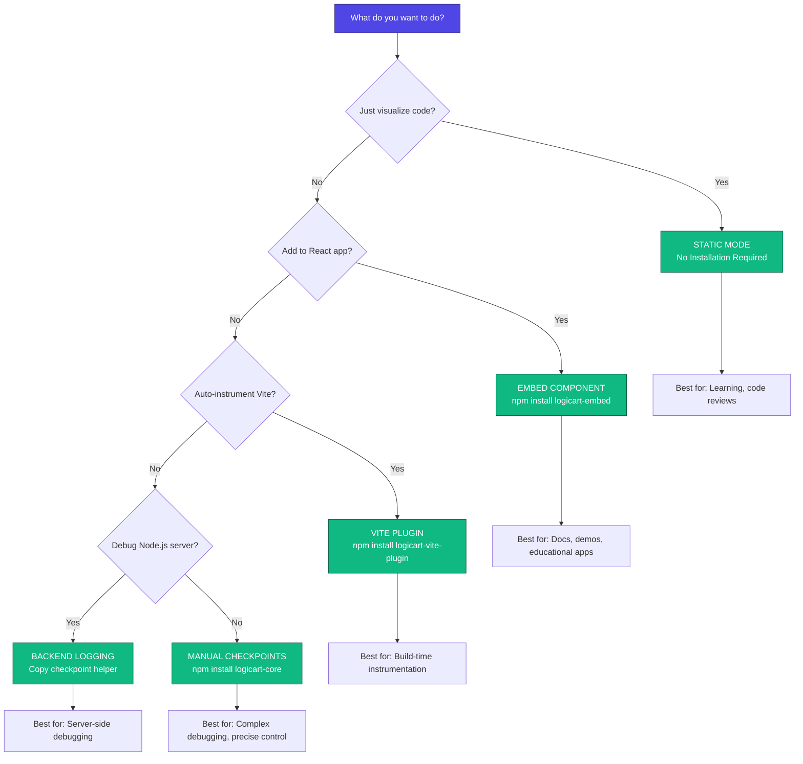

# LogicArt Installation Guide

**Add LogicArt visualization to your JavaScript projects**

---

## 🎯 Which Integration Method Should I Use?

### Quick Reference Table

| Your Goal | Best Method | Installation | Best For |
|-----------|-------------|--------------|----------|
| 📖 Just visualize code to understand it | **Static Mode** | None | Learning, code reviews, quick visualization |
| 🔧 Add flowcharts to my React app | **Embed Component** | `npm install logicart-embed` | Documentation, demos, educational apps |
| 🏗️ Auto-instrument my Vite project | **Vite Plugin** | `npm install logicart-vite-plugin` | Build-time instrumentation, minimal code changes |
| 🐛 Debug my Node.js/Express server | **Backend Logging** | Copy helper function | Server-side debugging, API logic |
| 🎯 Fine-grained control over checkpoints | **Manual Checkpoints** | `npm install logicart-core` | Complex debugging, precise instrumentation |

### Detailed Decision Tree

Use this decision tree to find the right approach:



---

## 📦 Installation Methods

Jump to your chosen method:

- [Static Mode (No Installation)](#static-mode-no-installation)
- [Embed Component (React)](#embed-component-react)
- [Vite Plugin (Build-Time)](#vite-plugin-build-time)
- [Backend Logging (Node.js)](#backend-logging-nodejs)
- [Manual Checkpoints (Advanced)](#manual-checkpoints-advanced)
- [IDE Extensions](#ide-extensions)

---

## Static Mode (No Installation)

**Best for:** Quick visualization, learning, code reviews

### What You Get
- ✅ Instant flowchart visualization
- ✅ Step-through execution
- ✅ Variable tracking
- ❌ No real-time execution in your app

### How to Use

1. **Open** [LogicArt Studio](https://logicart.studio)
2. **Paste** your JavaScript code into the editor
3. **Watch** the flowchart appear automatically
4. **Press** `Space` to step through

### Example

```javascript
function factorial(n) {
  if (n <= 1) return 1;
  return n * factorial(n - 1);
}
```

**That's it!** No installation, no configuration.

### When to Use Static Mode

✅ **Good for:**
- Understanding algorithm logic
- Code reviews and documentation
- Teaching programming concepts
- Quick debugging of isolated functions

❌ **Not ideal for:**
- Real-time execution tracking
- Debugging running applications
- Integration with your codebase

---

## Embed Component (React)

**Best for:** Adding flowcharts to React apps, documentation sites, educational tools

### Installation

```bash
npm install logicart-embed
```

### Required CSS

```javascript
import '@xyflow/react/dist/style.css';
```

### Basic Usage

```javascript
import { LogicArtEmbed } from 'logicart-embed';
import '@xyflow/react/dist/style.css';

function CodeViewer() {
  const code = `
    function bubbleSort(arr) {
      for (let i = 0; i < arr.length; i++) {
        for (let j = 0; j < arr.length - i - 1; j++) {
          if (arr[j] > arr[j + 1]) {
            [arr[j], arr[j + 1]] = [arr[j + 1], arr[j]];
          }
        }
      }
      return arr;
    }
  `;
  
  return (
    <LogicArtEmbed
      code={code}
      theme="dark"
      position="bottom-right"
      defaultOpen={true}
      showVariables={true}
    />
  );
}
```

### Component Props

| Prop | Type | Default | Description |
|------|------|---------|-------------|
| `code` | string | - | JavaScript code to visualize (Static Mode) |
| `manifestUrl` | string | - | Manifest URL for Live Mode |
| `theme` | `'dark'` \| `'light'` | `'dark'` | Color theme |
| `position` | string | `'bottom-right'` | Panel position |
| `showVariables` | boolean | `true` | Show variable inspector |
| `showHistory` | boolean | `false` | Show checkpoint history |
| `defaultOpen` | boolean | `false` | Open panel by default |
| `onNodeClick` | function | - | Callback when node is clicked |

### Advanced Example

```javascript
import { LogicArtEmbed } from 'logicart-embed';
import { useState } from 'react';

function AlgorithmDemo() {
  const [selectedAlgo, setSelectedAlgo] = useState('bubble');
  
  const algorithms = {
    bubble: `function bubbleSort(arr) { /* ... */ }`,
    quick: `function quickSort(arr) { /* ... */ }`,
    merge: `function mergeSort(arr) { /* ... */ }`
  };
  
  return (
    <div>
      <select onChange={(e) => setSelectedAlgo(e.target.value)}>
        <option value="bubble">Bubble Sort</option>
        <option value="quick">Quick Sort</option>
        <option value="merge">Merge Sort</option>
      </select>
      
      <LogicArtEmbed
        code={algorithms[selectedAlgo]}
        theme="dark"
        showVariables={true}
        onNodeClick={(nodeId) => console.log('Clicked:', nodeId)}
      />
    </div>
  );
}
```

### Verification Checklist

- [ ] `logicart-embed` appears in `package.json`
- [ ] CSS import is present: `import '@xyflow/react/dist/style.css';`
- [ ] Component renders without errors
- [ ] Flowchart displays nodes for your code
- [ ] Step controls work (Space, S, R)

### Troubleshooting

**"Module not found: logicart-embed"**
```bash
rm -rf node_modules package-lock.json
npm install
```

**CSS not loading**
```javascript
// Make sure this is at the top of your file
import '@xyflow/react/dist/style.css';
```

**Flowchart not appearing**
- Check browser console for errors
- Verify `code` prop is a valid string
- Ensure React version is 16+

---

## Vite Plugin (Build-Time)

**Best for:** Automatic instrumentation, minimal code changes, Vite projects

### Installation

```bash
npm install logicart-vite-plugin --save-dev
npm install logicart-embed
```

### Configuration

```javascript
// vite.config.js
import { defineConfig } from 'vite';
import react from '@vitejs/plugin-react';
import logicartPlugin from 'logicart-vite-plugin';

export default defineConfig({
  plugins: [
    react(),
    logicartPlugin({
      include: ['src/**/*.tsx', 'src/**/*.ts'],
      exclude: ['**/node_modules/**', '**/*.test.*'],
      manifestPath: 'logicart-manifest.json',
      autoInstrument: true,
      captureVariables: true
    })
  ]
});
```

### Plugin Options

| Option | Type | Default | Description |
|--------|------|---------|-------------|
| `include` | string[] | `['**/*.js', '**/*.ts']` | Files to instrument |
| `exclude` | string[] | `['/node_modules/']` | Files to skip |
| `manifestPath` | string | `'logicart-manifest.json'` | Output path for manifest |
| `autoInstrument` | boolean | `true` | Auto-inject checkpoints |
| `captureVariables` | boolean | `true` | Capture local variables |

### Add Embed Component

```javascript
// src/App.tsx
import { LogicArtEmbed } from 'logicart-embed';
import '@xyflow/react/dist/style.css';

function App() {
  return (
    <div>
      {/* Your app content */}
      
      <LogicArtEmbed
        manifestUrl="/logicart-manifest.json"
        showVariables={true}
        showHistory={true}
        theme="dark"
      />
    </div>
  );
}
```

### Build and Run

```bash
npm run dev
```

### What the Plugin Does

1. **Parses** your source files using Acorn
2. **Injects** `LogicArt.checkpoint()` calls at key points
3. **Generates** `logicart-manifest.json` with flowchart data
4. **Injects** runtime script into your HTML

### Output Files

```
dist/
├── logicart-manifest.json   # Flowchart nodes, edges, checkpoint metadata
└── logicart-runtime.js      # Browser runtime for checkpoint handling
```

### Verification Checklist

- [ ] `logicart-vite-plugin` in `devDependencies`
- [ ] `logicart-embed` in `dependencies`
- [ ] `vite.config.js` includes `logicartPlugin()`
- [ ] Build completes without errors
- [ ] `logicart-manifest.json` is generated in `dist/`
- [ ] Flowchart shows with variable tracking

### Troubleshooting

**Manifest not generated**
- Check `include` patterns match your files
- Verify build completes successfully
- Look for errors in terminal output

**No variable tracking**
- Ensure `captureVariables: true` (default)
- Check that instrumented code is executing
- Verify `showVariables={true}` in `LogicArtEmbed`

---

## Backend Logging (Node.js)

**Best for:** Server-side debugging, API logic, Node.js/Express apps

### What You Get
- ✅ Execution logging to console
- ✅ Variable tracking
- ✅ Works with any Node.js code
- ❌ Console logs only (no visual flowchart in real-time)

### Installation

**No npm package needed!** Just add the helper function.

### Step 1: Add Checkpoint Helper

Add this to your main server file (e.g., `server.ts`, `routes.ts`, `index.ts`):

```typescript
// LogicArt checkpoint helper for execution visualization
const LogicArt = {
  checkpoint(nodeId: string, options: { variables?: Record<string, any> } = {}) {
    const vars = options.variables || {};
    console.log(`[LogicArt] ${nodeId}`, JSON.stringify(vars, null, 2));
  }
};
```

**JavaScript version:**
```javascript
const LogicArt = {
  checkpoint(nodeId, options = {}) {
    const vars = options.variables || {};
    console.log(`[LogicArt] ${nodeId}`, JSON.stringify(vars, null, 2));
  }
};
```

### Step 2: Add Checkpoints

```typescript
async function processOrder(order: Order) {
  LogicArt.checkpoint('order:start', {
    variables: { orderId: order.id, items: order.items.length }
  });

  const isValid = validateOrder(order);
  
  if (!isValid) {
    LogicArt.checkpoint('order:invalid', {
      variables: { error: 'Validation failed' }
    });
    return { success: false };
  }

  LogicArt.checkpoint('order:payment', {
    variables: { amount: order.total }
  });
  
  const payment = await processPayment(order);

  LogicArt.checkpoint('order:complete', {
    variables: { success: true, transactionId: payment.id }
  });
  
  return { success: true, payment };
}
```

### Step 3: Run and Watch

Start your server and watch the console:

```bash
npm run dev
```

**Console output:**
```
[LogicArt] order:start {
  "orderId": "abc123",
  "items": 3
}
[LogicArt] order:payment {
  "amount": 99.99
}
[LogicArt] order:complete {
  "success": true,
  "transactionId": "txn_456"
}
```

### Visualizing Backend Code

**💡 Pro Tip:** To see the flowchart structure:

1. Copy your server code
2. Paste into LogicArt Studio
3. See the flowchart visualization
4. Correlate flowchart nodes with console logs

**Example workflow:**
```
1. Paste server code into LogicArt Studio → See flowchart
2. Run server → See console logs
3. Match log IDs to flowchart nodes
4. Understand execution flow visually
```

### Checkpoint Naming Convention

Use hierarchical names for organized logging:

```javascript
// Format: section:action:detail
LogicArt.checkpoint('auth:login:start');
LogicArt.checkpoint('auth:login:validate');
LogicArt.checkpoint('auth:login:success');

LogicArt.checkpoint('api:users:fetch');
LogicArt.checkpoint('api:users:response');

LogicArt.checkpoint('db:query:start', { variables: { sql } });
LogicArt.checkpoint('db:query:complete', { variables: { rows: result.length } });
```

### Verification Checklist

- [ ] Checkpoint helper is added to server file
- [ ] At least one `LogicArt.checkpoint()` call exists
- [ ] Console shows `[LogicArt]` logs when code runs
- [ ] Logs include checkpoint ID and variables

### Troubleshooting

**No logs appearing**
- Verify checkpoint helper is defined
- Check that instrumented code is executing
- Look for JavaScript errors preventing execution

**TypeScript errors**
- Use the TypeScript version of the helper (with type annotations)
- Ensure `Record<string, any>` type is available

---

## Manual Checkpoints (Advanced)

**Best for:** Fine-grained control, complex debugging, precise instrumentation

### Installation

```bash
npm install logicart-core
```

### Synchronous Checkpoints

```javascript
import { checkpoint } from 'logicart-core';

function bubbleSort(arr) {
  checkpoint('sort:start', { arr: [...arr] });
  
  for (let i = 0; i < arr.length; i++) {
    checkpoint('sort:outer', { i });
    
    for (let j = 0; j < arr.length - i - 1; j++) {
      if (arr[j] > arr[j + 1]) {
        [arr[j], arr[j + 1]] = [arr[j + 1], arr[j]];
        checkpoint('sort:swap', { i, j, arr: [...arr] });
      }
    }
  }
  
  checkpoint('sort:end', { arr });
  return arr;
}
```

### Async Checkpoints (With Breakpoints)

```javascript
import { checkpointAsync, LogicArtRuntime } from 'logicart-core';

const runtime = new LogicArtRuntime({ manifestHash: 'abc123' });
runtime.setBreakpoint('critical_point', true);

async function processData(data) {
  await checkpointAsync('process:start', { data });
  
  // Execution pauses here if breakpoint is set
  await checkpointAsync('critical_point', { data });
  
  const result = await transform(data);
  
  await checkpointAsync('process:complete', { result });
  return result;
}

// Resume execution from breakpoint
runtime.resume();
```

### Runtime API

```javascript
const runtime = new LogicArtRuntime();

// Session control
runtime.start();                           // Begin session
runtime.end();                             // End session

// Checkpoints
runtime.checkpoint('id', { vars });        // Record checkpoint

// Breakpoints
runtime.setBreakpoint('id', true);         // Enable breakpoint
runtime.removeBreakpoint('id');            // Remove breakpoint
runtime.clearBreakpoints();                // Clear all

// Execution control
runtime.resume();                          // Continue from breakpoint
```

### Best Practices

**1. Use Descriptive IDs**
```javascript
// ❌ Bad
checkpoint('cp1', { data });
checkpoint('cp2', { result });

// ✅ Good
checkpoint('validation:start', { data });
checkpoint('validation:complete', { result });
```

**2. Snapshot Arrays**
```javascript
// ❌ Bad (reference)
checkpoint('sort:step', { arr });

// ✅ Good (snapshot)
checkpoint('sort:step', { arr: [...arr] });
```

**3. Track Progress in Loops**
```javascript
for (let i = 0; i < items.length; i++) {
  checkpoint('batch:item', {
    index: i,
    itemId: items[i].id,
    progress: `${i + 1}/${items.length}`
  });
  
  await processItem(items[i]);
}
```

### Verification Checklist

- [ ] `logicart-core` in `package.json`
- [ ] Checkpoints are being called
- [ ] LogicArt Studio receives checkpoint data
- [ ] Variables are tracked correctly

---

## IDE Extensions

Add LogicArt visualization directly to your IDE.

### Supported IDEs

- [VS Code](#vs-code-extension)
- [Cursor](#cursor-extension)
- [Antigravity](#antigravity-extension)
- [Windsurf](#windsurf-extension)

---

### VS Code Extension

**Prerequisites:**
- Visual Studio Code 1.85.0+
- JavaScript or TypeScript project

**Installation:**

**Option 1: Install from VSIX**

1. Download `logicart-1.0.0.vsix` from [GitHub Releases](https://github.com/JPaulGrayson/LogicArt/releases)
2. Open VS Code
3. Press `Cmd+Shift+P` (Mac) or `Ctrl+Shift+P` (Windows/Linux)
4. Type: `Extensions: Install from VSIX`
5. Select the downloaded `.vsix` file
6. Click **Install**
7. Reload window: `Cmd+Shift+P` → `Reload Window`

**Option 2: Manual Installation**

```bash
# Mac
mkdir -p ~/.vscode/extensions/logicart.logicart-1.0.0
unzip logicart-1.0.0.vsix -d ~/.vscode/extensions/logicart.logicart-1.0.0
cd ~/.vscode/extensions/logicart.logicart-1.0.0
mv extension/* . && rm -rf extension

# Windows
mkdir %USERPROFILE%\.vscode\extensions\logicart.logicart-1.0.0
# Extract VSIX to this folder

# Linux
mkdir -p ~/.vscode/extensions/logicart.logicart-1.0.0
unzip logicart-1.0.0.vsix -d ~/.vscode/extensions/logicart.logicart-1.0.0
cd ~/.vscode/extensions/logicart.logicart-1.0.0
mv extension/* . && rm -rf extension
```

**Usage:**

1. Open any `.js` or `.ts` file
2. Press `Cmd+Shift+P` → `LogicArt: Visualize Current File`
3. Flowchart panel appears beside your code
4. Click nodes to jump to that line

**Verification:**

- [ ] `LogicArt: Visualize Current File` appears in Command Palette
- [ ] Flowchart panel opens
- [ ] Nodes appear for code's control flow
- [ ] Clicking nodes jumps to corresponding line
- [ ] Example selector updates flowchart

**Troubleshooting:**

**"No matching commands"**
- Extension isn't installed or activated
- Reload window: `Cmd+Shift+P` → `Reload Window`
- Ensure you have a `.js` or `.ts` file open

**"Syntax Error" in flowchart**
- Code has JavaScript syntax error
- TypeScript-specific syntax may fail (Acorn parser)

---

### Cursor Extension

**Prerequisites:**
- Cursor IDE (latest version)
- JavaScript or TypeScript project

**Installation:**

Same as VS Code (Cursor is a VS Code fork):

```bash
# Cursor extensions folder
mkdir -p ~/.cursor/extensions/logicart.logicart-1.0.0
unzip logicart-1.0.0.vsix -d ~/.cursor/extensions/logicart.logicart-1.0.0
cd ~/.cursor/extensions/logicart.logicart-1.0.0
mv extension/* . && rm -rf extension
```

**Usage:**

Same as VS Code:
1. Open `.js` or `.ts` file
2. `Cmd+Shift+P` → `LogicArt: Visualize Current File`

---

### Antigravity Extension

**Prerequisites:**
- Antigravity IDE (latest version)
- JavaScript or TypeScript project

**Installation:**

**Manual Installation (Required)**

The standard VSIX installer may not work in Antigravity due to differences in the extension system architecture. Antigravity uses a custom extension loading mechanism that requires manual installation for compatibility. Use the following steps:

```bash
# Antigravity extensions folder
mkdir -p ~/.antigravity/extensions/logicart.logicart-1.0.0
unzip logicart-1.0.0.vsix -d ~/.antigravity/extensions/logicart.logicart-1.0.0
cd ~/.antigravity/extensions/logicart.logicart-1.0.0
mv extension/* . && rm -rf extension
```

Reload Antigravity: `Cmd+Shift+P` → `Reload Window`

**Usage:**

1. Open `.js` or `.ts` file
2. `Cmd+Shift+P` → `LogicArt: Visualize Current File`
3. Click nodes to jump to source code

**Verification:**

- [ ] Extension folder exists at `~/.antigravity/extensions/logicart.logicart-1.0.0/`
- [ ] LogicArt command appears after reload
- [ ] Flowchart displays when command is run
- [ ] Clicking nodes jumps to source

**Troubleshooting:**

**Extension not appearing**
- Verify folder structure: `ls ~/.antigravity/extensions/logicart.logicart-1.0.0/`
- Should contain: `package.json`, `dist/`, `icon.png`
- If you see `extension/` subfolder, extraction failed

---

### Windsurf Extension

**Prerequisites:**
- Windsurf IDE by Codeium (latest version)
- JavaScript or TypeScript project

**Installation:**

**Option 1: Import from Cursor**

If you have Cursor with LogicArt installed:
1. Launch Windsurf
2. Select "Import from Cursor"
3. LogicArt is automatically imported

**Option 2: Manual Installation**

```bash
# Windsurf extensions folder
mkdir -p ~/.windsurf/extensions/logicart.logicart-1.0.0
unzip logicart-1.0.0.vsix -d ~/.windsurf/extensions/logicart.logicart-1.0.0
cd ~/.windsurf/extensions/logicart.logicart-1.0.0
mv extension/* . && rm -rf extension
```

---

## 🎯 Comparison Table

| Method | Installation | Real-Time | Variable Tracking | Use Case |
|--------|--------------|-----------|-------------------|----------|
| **Static Mode** | None | ❌ | ✅ (simulated) | Quick visualization |
| **Embed Component** | `npm install` | ❌ | ✅ (simulated) | React apps, docs |
| **Vite Plugin** | `npm install` | ✅ | ✅ | Build-time instrumentation |
| **Backend Logging** | Copy helper | ✅ | ✅ | Server-side debugging |
| **Manual Checkpoints** | `npm install` | ✅ | ✅ | Fine-grained control |
| **IDE Extensions** | VSIX install | ❌ | ✅ (simulated) | In-editor visualization |

---

## 🐛 General Troubleshooting

### Package Not Found

```bash
# Clear cache and reinstall
rm -rf node_modules package-lock.json
npm cache clean --force
npm install
```

### Checkpoints Not Logging

1. Verify checkpoint helper/import is present
2. Check that instrumented code is executing
3. Look for JavaScript errors in console

### TypeScript Errors

Use typed checkpoint helper:

```typescript
const LogicArt = {
  checkpoint(nodeId: string, options: { variables?: Record<string, any> } = {}) {
    const vars = options.variables || {};
    console.log(`[LogicArt] ${nodeId}`, JSON.stringify(vars, null, 2));
  }
};
```

### Extension Installation Failed

For VS Code forks:
1. Use manual installation (unzip to extensions folder)
2. Verify `package.json` is at root level (not in `extension/` subfolder)
3. Reload IDE after installation

---

## 📚 Next Steps

### After Installation

1. ✅ Add checkpoints to key functions
2. ✅ Run your code and watch logs/flowcharts
3. ✅ Use step-through controls to debug
4. ✅ Share flowcharts with your team

### Learn More

- **[Getting Started Guide](GETTING_STARTED.md)** - Tutorials and workflows
- **[API Reference](API_REFERENCE.md)** - Complete API documentation
- **[GitHub Repository](https://github.com/JPaulGrayson/LogicArt)** - Source code

---

## 🆘 Getting Help

- **Documentation**: See in-app Help dialog (`?` button)
- **Examples**: Try built-in algorithm examples
- **GitHub Issues**: [Report bugs or request features](https://github.com/JPaulGrayson/LogicArt/issues)

---

**Made with ❤️ for Vibe Coders everywhere**
