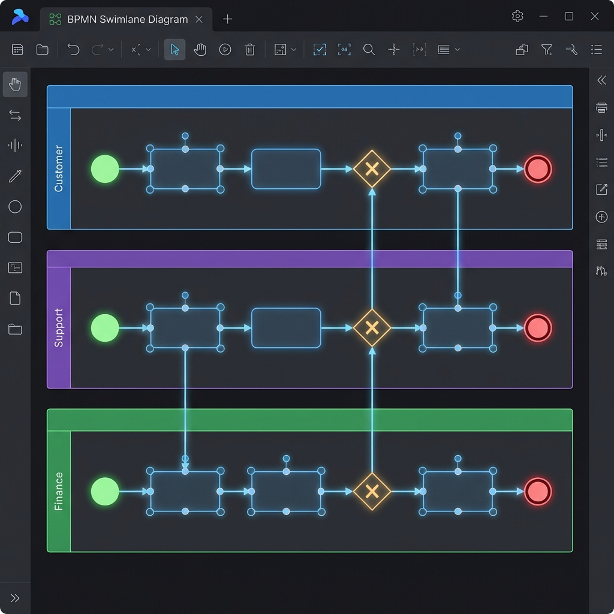

# 🏊 LogicProcess - BPMN Swimlane Diagrams

<div align="center">
  
  <p><em>Visual process modeling with AI-powered generation</em></p>
</div>

---

## Overview

**LogicProcess** is a BPMN (Business Process Model and Notation) swimlane diagram tool integrated into LogicArt. It enables AI-powered process visualization and cross-platform workflow design.

### Key Features

| Feature | Description |
|---------|-------------|
| **Natural Language Input** | Describe a process in plain English, get a diagram |
| **Swimlane Layouts** | Organize tasks by role/department |
| **BPMN Notation** | Standard start/end events, tasks, gateways |
| **Export Options** | PNG, SVG, JSON for integration |
| **Orchestrate Integration** | Import templates from Orchestrate.us.com |

---

## 🎯 Quick Start

### 1. Access LogicProcess

Navigate to the **Process** tab in LogicArt or visit:
```
https://logicart.us.com/process
```

### 2. Describe Your Process

Enter a natural language description:

> "Customer submits refund request, support reviews it, finance approves or rejects, customer is notified"

### 3. Generate Diagram

Click **Generate** and LogicProcess creates a complete swimlane diagram with:
- Roles identified (Customer, Support, Finance)
- Process steps mapped
- Decision points marked
- Connections drawn

---

## 📊 BPMN Elements

### Node Types

| Element | Symbol | Description |
|---------|--------|-------------|
| **Start Event** | 🟢 | Process entry point (green circle) |
| **End Event** | 🔴 | Process completion (red circle) |
| **Task** | ▭ | Work activity (rounded rectangle) |
| **Gateway** | ◇ | Decision point (diamond) |
| **Subprocess** | ▭▭ | Nested process (double border) |

### Swimlanes

Horizontal lanes represent different actors or departments:

```
┌─────────────────────────────────────────────────────────┐
│ Customer   │ ○──▶[Submit Request]──▶...                │
├─────────────────────────────────────────────────────────┤
│ Support    │ ...[Review]──◇──▶[Escalate]──▶...         │
├─────────────────────────────────────────────────────────┤
│ Finance    │ ...[Approve/Reject]──▶[Process]──▶●       │
└─────────────────────────────────────────────────────────┘
```

---

## 💻 API Endpoints

### Generate Diagram

```http
POST /api/process/generate
Content-Type: application/json

{
  "description": "Customer submits refund request, support reviews it, finance approves or rejects"
}
```

**Response:** Complete React Flow diagram with nodes, edges, and positioning.

### Import from Orchestrate

```http
POST /api/process/import
x-logiprocess-secret: your-secret-key
Content-Type: application/json

{
  "nodes": [...],
  "edges": [...],
  "title": "Imported Workflow",
  "description": "From Orchestrate template"
}
```

### Ralph Wiggum Mode

Generate AI coding artifacts instead of BPMN diagrams:

```http
POST /api/process/generate-ralph
Content-Type: application/json

{
  "description": "Build a REST API with authentication"
}
```

See the [Ralph Wiggum Guide](RALPH_WIGGUM_GUIDE.md) for details.

---

## 🔗 Orchestrate Integration

LogicProcess integrates with [Orchestrate.us.com](https://orchestrate.us.com) for workflow templates:

### Importing Templates

1. In Orchestrate, select a workflow template
2. Click **"Open in LogicArt"**
3. Template appears in LogicProcess with full editing capabilities

### Agent Templates Available

| Category | Templates |
|----------|-----------|
| **Brokerage** | Compute Broker, Table Broker, Prediction Trader |
| **Utility** | Echo Agent, Research Agent, Data Transform |
| **Coordination** | Scheduler, Moderator, Orchestrator |
| **Domain** | Code Review, Meeting Summarizer, Price Monitor |

---

## 🎨 Customization

### Role Colors

Each swimlane can be customized with different colors:

| Default Color | Role Type |
|---------------|-----------|
| 🔵 Blue | Customer-facing |
| 🟣 Purple | Internal support |
| 🟢 Green | Financial/approval |
| 🟡 Yellow | External systems |

### Styling Options

- Drag nodes to reposition
- Double-click to edit labels
- Right-click for context menu
- Resize swimlanes by dragging edges

---

## 📤 Export Options

| Format | Use Case |
|--------|----------|
| **PNG** | Documentation, presentations |
| **SVG** | Scalable vector graphics |
| **JSON** | Import into other tools |
| **React Flow** | Embed in React applications |

---

## 🔧 Example Workflow

### Input Description

```
"Sales team captures lead, marketing qualifies the lead, 
sales rep contacts qualified leads, if interested schedule demo, 
if not interested add to nurture campaign, 
after demo close deal or return to nurture"
```

### Generated Roles

1. **Sales** - Lead capture, contact, demo, close
2. **Marketing** - Qualification, nurture campaigns

### Generated Flow

```
[Capture Lead] → [Qualify] → ◇ Qualified?
                              ├─ Yes → [Contact] → ◇ Interested?
                              │                     ├─ Yes → [Demo] → ◇ Close?
                              │                     │                  ├─ Yes → [Deal Won]
                              │                     │                  └─ No → [Nurture]
                              │                     └─ No → [Nurture]
                              └─ No → [Nurture]
```

---

## 🔗 Related Documentation

- [Agent API Reference](AGENT_API.md) — Full API documentation
- [Ralph Wiggum Guide](RALPH_WIGGUM_GUIDE.md) — AI coding loop technique
- [MCP Integration](/api/docs/mcp-guide) — Claude/Cursor integration

---

<div align="center">
  <strong>LogicProcess</strong> — From description to diagram in seconds
</div>
