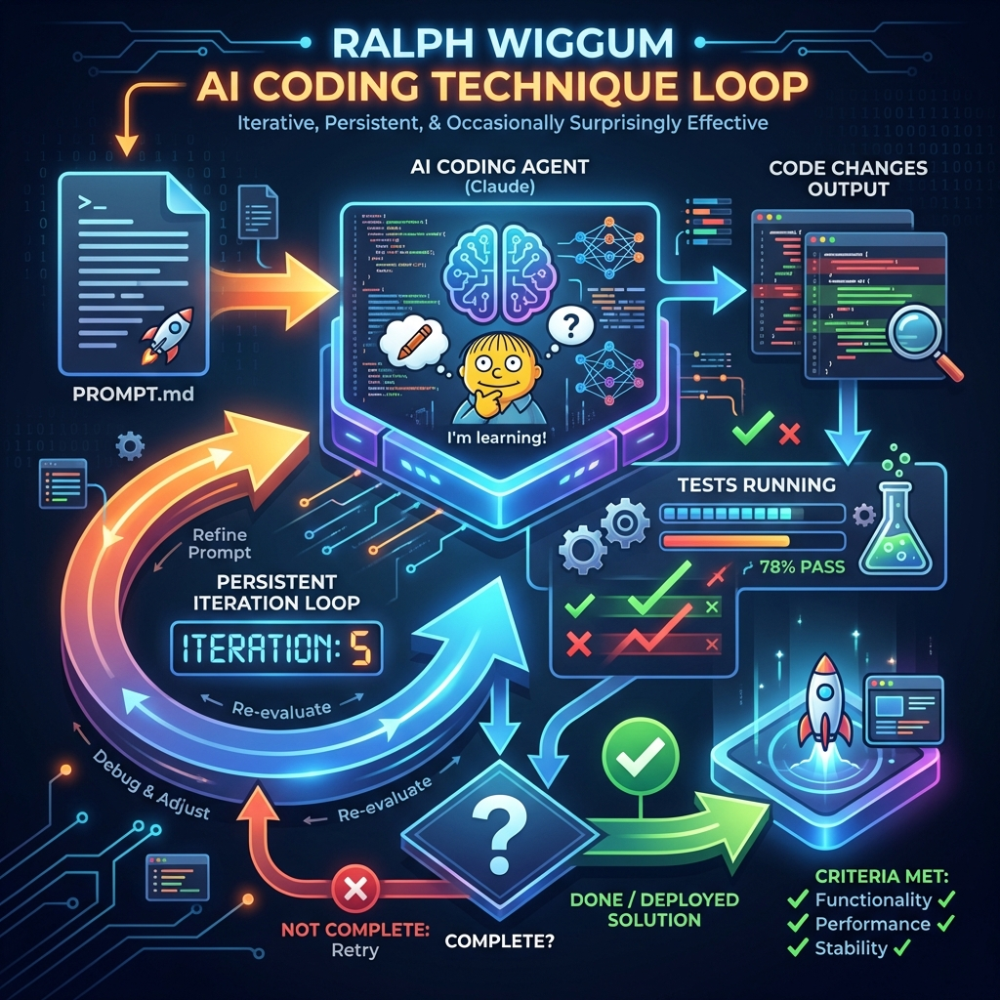

# 🔄 Ralph Wiggum AI Coding Technique

<div align="center">
  
  <p><em>Iterative, Persistent, & Occasionally Surprisingly Effective</em></p>
</div>

---

## Overview

The **Ralph Wiggum technique** is a popular AI-assisted software development method named after the dim-witted but relentlessly persistent and optimistic child character from *The Simpsons*.

It was coined in 2025 by software engineer **Geoffrey Huntley** as a simple yet effective way to run AI coding agents (like Claude Code) autonomously and iteratively on complex tasks—often for hours or overnight with minimal supervision.

### The Core Problem

AI coding agents often declare a task "done" prematurely, before it's truly complete, polished, or verified. Ralph Wiggum counters this by trapping the agent in a **persistent loop** that repeatedly re-feeds the same prompt until objective completion criteria are met.

---

## 🔧 Basic Implementation

In its simplest form, it's a basic Bash while loop:

```bash
while :; do
  cat PROMPT.md | claude-code
done
```

### How It Works

1. **PROMPT.md** contains your detailed instructions and acceptance criteria
2. The AI coding agent reads the prompt and makes changes to the codebase
3. When the agent tries to exit, the loop catches it and restarts immediately
4. Each iteration builds incrementally on prior work (code, tests, fixes)
5. Loop continues until completion criteria are met

> *"Brute-force persistence favors repetition and error correction over perfect first-try precision."*

---

## 📁 Recommended File Structure

Advanced implementations use supporting files to guide the agent:

```
project/
├── PROMPT.md          # Main task instructions
├── plan.md            # Implementation plan with phases
├── progress.md        # Status tracking (helps avoid repetition)
└── specs/             # Detailed requirements/JTBD
    ├── feature-1.md
    ├── feature-2.md
    └── acceptance.md
```

---

## 🔄 Three-Phase Workflow

| Phase | Description | Output |
|-------|-------------|--------|
| **1. Requirements** | Human + LLM conversation to define specs | `specs/` directory |
| **2. Planning** | Generate comprehensive implementation plan | `plan.md` |
| **3. Execution** | Run the persistent loop on the plan | Working code! |

---

## 🚀 LogicArt Integration

LogicArt provides a **Ralph Wiggum Mode** that generates all the artifacts you need to start a coding session:

### Generate Artifacts via API

```bash
curl -X POST https://logicart.us.com/api/process/generate-ralph \
  -H "Content-Type: application/json" \
  -d '{
    "description": "Implement a REST API with Express.js including user authentication and rate limiting"
  }'
```

### Response

```json
{
  "artifacts": {
    "PROMPT.md": "# AI Coding Task\n\n## Objective\n...",
    "plan.md": "# Implementation Plan\n\n## Phase 1: Setup\n...",
    "progress.md": "# Progress Tracker\n\n## Status: Not Started\n..."
  }
}
```

### Using the UI

1. Navigate to **LogicProcess** in LogicArt
2. Toggle **Ralph Wiggum Mode**
3. Enter your task description
4. Click **Generate**
5. Use the **Export** button to download all artifacts as a ZIP

---

## ✅ Best Use Cases

Ralph Wiggum excels at **verifiable, mechanical tasks** with objective success metrics:

| ✅ Great For | ❌ Not Ideal For |
|-------------|-----------------|
| Legacy code refactoring | Subjective UX design |
| Dependency updates | Ambiguous business logic |
| Test coverage expansion | Tasks needing frequent feedback |
| Codebase migrations | Creative/design decisions |
| Greenfield feature builds | Security-critical code |
| Porting across platforms | |

---

## 📖 Example: Overnight Automation

> *"At a Y Combinator event, a coding agent in a while loop shipped 6 repos overnight."*

### Real-World Success Stories

- **900k-line Windows game engine** ported to macOS
- **CURSED** — An entirely new esoteric programming language built from scratch
- **Automated test suites** generated for undocumented legacy codebases

---

## ⚠️ Limitations & Safety

### Risks

| Risk | Mitigation |
|------|------------|
| Infinite looping | Set iteration/token/cost limits |
| Context drift | Use progress tracking |
| Wrong turns | Monitor and intervene as needed |
| High token usage | Set budget caps |

### Best Practices

1. **Clear "done" conditions** — Define objective success criteria
2. **Progress tracking** — Include `progress.md` to help agent prioritize
3. **Start small** — Test with smaller scopes first
4. **Monitor output** — Review before committing to main branch
5. **Use sandboxing** — Run in isolated worktrees for safety

---

## 🔗 Official Resources

- **Claude Code Plugin** — Official Ralph Wiggum plugin for persistent loops
- **Geoffrey Huntley's original blog post** — "Ralph Wiggum as a 'software engineer'"
- **GitHub** — `how-to-ralph-wiggum` community repository

---

## 🎯 Quick Start

### 1. Create Your Prompt

```markdown
# PROMPT.md

## Objective
Build a REST API with user authentication.

## Acceptance Criteria
- [ ] Express.js server with /api routes
- [ ] JWT-based authentication
- [ ] User registration and login endpoints
- [ ] Rate limiting middleware
- [ ] All tests passing

## Done Condition
When all checkboxes above are checked and `npm test` passes with 100% coverage.
```

### 2. Start the Loop

```bash
# Simple loop
while :; do cat PROMPT.md | claude-code; done

# With iteration limit
for i in {1..50}; do cat PROMPT.md | claude-code; done
```

### 3. Wake Up to Progress

Check your code, run tests, and enjoy the fruits of persistent AI labor! 🎉

---

<div align="center">
  <em>"Ralph will test you by failing—treat it as tuning and iterative improvement."</em>
  <br><br>
  <strong>LogicArt</strong> — Visualize, Plan, Execute
</div>
