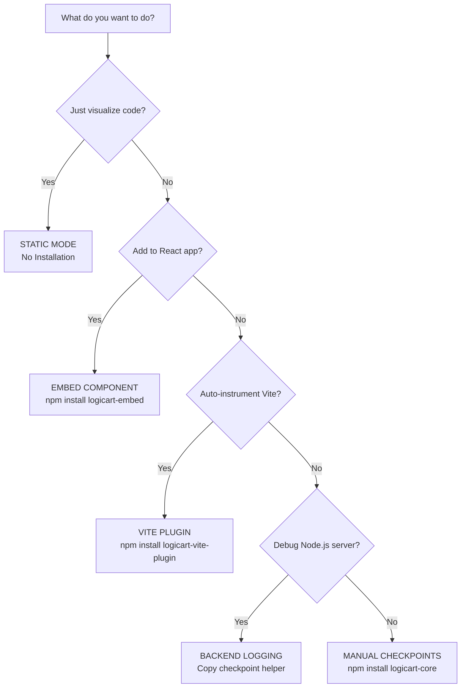

# LogicArt Documentation Issues & Recommendations

**Date:** December 31, 2025  
**Reviewer:** Paul  
**Status:** Needs Updates

---

## 🔍 Issues Identified

### **Issue 1: HTML Example Missing Context**

**Location:** `docs/VIBE_CODER_GUIDE.md` - Lines 15-22

**Current:**
```html
<head>
  <meta charset="UTF-8" />
  <!-- other head content -->
  <script src="https://your-logicart-app.replit.dev/remote.js?project=MyApp"></script>
</head>
```

**Problem:** Shows only the `<head>` section, not a complete HTML file example.

**Recommendation:** Add a complete HTML example:

```html
<!DOCTYPE html>
<html lang="en">
<head>
  <meta charset="UTF-8" />
  <meta name="viewport" content="width=device-width, initial-scale=1.0" />
  <title>My App</title>
  
  <!-- LogicArt Remote Mode Script -->
  <script src="https://your-logicart-app.replit.dev/remote.js?project=MyApp"></script>
</head>
<body>
  <div id="app"></div>
  <script src="./main.js"></script>
</body>
</html>
```

**Priority:** MEDIUM

---

### **Issue 2: Decision Tree Should Be a Visual Diagram**

**Location:** `docs/INSTALLATION_GUIDE.md` - Lines 7-53

**Current:** ASCII art decision tree (hard to read)

**Problem:** 
- Difficult to scan visually
- Not accessible
- Doesn't look professional
- Hard to follow the flow

**Recommendation:** Create a visual flowchart diagram

**Options:**

**Option A: Create an image** (Best for clarity)
- Use a tool like Mermaid, Lucidchart, or Figma
- Export as PNG/SVG
- Embed in documentation

**Option B: Use Mermaid diagram** (Best for maintainability)
```markdown

```

**Option C: Simplify to a table** (Quick fix)

| Your Goal | Method | Installation |
|-----------|--------|--------------|
| Just visualize code | Static Mode | None - use LogicArt Studio |
| Add to React app | Embed Component | `npm install logicart-embed` |
| Auto-instrument Vite | Vite Plugin | `npm install logicart-vite-plugin` |
| Debug Node.js server | Backend Logging | Copy helper function |
| Fine-grained control | Manual Checkpoints | `npm install logicart-core` |

**Priority:** HIGH

---

### **Issue 3: Antigravity VSIX Installer Note**

**Location:** `docs/INSTALLATION_GUIDE.md` - Lines 729-731

**Current:**
```markdown
**Manual Installation (Required)**

The standard VSIX installer may not work in Antigravity. Use manual installation:
```

**Problem:** Doesn't explain WHY the VSIX installer may not work.

**Recommendation:** Add explanation:

```markdown
**Manual Installation (Required)**

The standard VSIX installer may not work in Antigravity due to differences in the extension system architecture. Antigravity uses a custom extension loading mechanism that requires manual installation. Use the following steps:
```

**Priority:** LOW (current text is functional, just could be more informative)

---

### **Issue 4: Help Dialog Content vs. Documentation**

**Location:** 
- In-app: `client/src/components/ide/HelpDialog.tsx`
- Docs: Various locations in `docs/`

**Current:** Help dialog has execution controls and advanced features that may not be fully documented elsewhere.

**Problem:** Content duplication and potential inconsistency between:
- In-app help dialog
- Main documentation files
- Quick reference guides

**Recommendation:** Create a content synchronization strategy:

**1. Define Content Ownership:**
- **Help Dialog:** Quick reference, keyboard shortcuts, basic usage
- **Documentation:** Comprehensive guides, installation, troubleshooting
- **Quick Reference:** Cheat sheet for common tasks

**2. Cross-Reference:**
```markdown
<!-- In Help Dialog -->
For detailed installation instructions, see the [Installation Guide](docs/INSTALLATION_GUIDE.md)

<!-- In Documentation -->
💡 **Quick Tip:** Press `?` in LogicArt Studio to see keyboard shortcuts
```

**3. Content to Keep in Help Dialog:**
- ✅ Execution Controls (Play/Pause, Step, Reset, Loop, Speed)
- ✅ Keyboard Shortcuts
- ✅ Advanced Features (Time Travel, Export, Search, Ghost Diff)
- ✅ Quick Start guide

**4. Content to Keep in Documentation:**
- ✅ Installation instructions
- ✅ Integration guides
- ✅ API reference
- ✅ Troubleshooting
- ✅ Best practices

**5. Content to Synchronize:**
- ⚠️ Keyboard shortcuts (should match between help dialog and docs)
- ⚠️ Feature descriptions (should be consistent)
- ⚠️ Examples (should use same code samples)

**Priority:** MEDIUM

---

## 📋 Recommended Actions

### Immediate (Before Replit Testing):

1. ✅ **No blockers** - Current documentation is functional
2. ⚠️ **Optional:** Improve decision tree (if time permits)

### Short-Term (After Replit Testing):

1. **Fix HTML Example** (30 minutes)
   - Add complete HTML file example
   - Show both simple and complex use cases

2. **Create Visual Decision Tree** (1-2 hours)
   - Use Mermaid diagram or create image
   - Make it interactive if possible
   - Test with users for clarity

3. **Expand Antigravity Note** (15 minutes)
   - Add explanation of why manual installation is needed
   - Link to Antigravity-specific troubleshooting

### Long-Term (Post-Launch):

1. **Content Audit** (4-6 hours)
   - Review all documentation
   - Identify duplicated content
   - Create content ownership matrix
   - Synchronize help dialog with docs

2. **Documentation Restructure** (8-12 hours)
   - Create clear hierarchy
   - Add navigation between related topics
   - Implement search functionality
   - Add interactive examples

---

## 🎯 Priority Matrix

| Issue | Impact | Effort | Priority | Status |
|-------|--------|--------|----------|--------|
| HTML Example | Low | Low | Medium | Open |
| Decision Tree | Medium | Medium | High | Open |
| VSIX Note | Low | Low | Low | Open |
| Help Dialog Sync | Medium | High | Medium | Open |

---

## 💡 Quick Wins

If you have 30 minutes before Replit testing:

1. **Add complete HTML example** to VIBE_CODER_GUIDE.md
2. **Add table version** of decision tree as alternative to ASCII art
3. **Add note** explaining Antigravity VSIX issue

These are non-blocking but would improve user experience.

---

## 🚀 Recommendation

**For Replit Testing:** ✅ **Proceed as-is**

The current documentation is functional and won't block testing. The issues identified are UX improvements, not critical bugs.

**Post-Testing:** Address issues in priority order (Decision Tree → HTML Example → Help Dialog Sync → VSIX Note)

---

**Reviewed by:** Paul  
**Date:** December 31, 2025  
**Next Review:** After Replit testing completion
